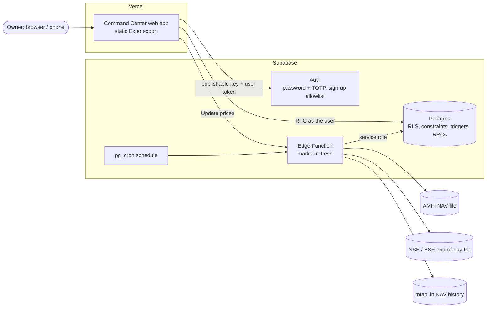
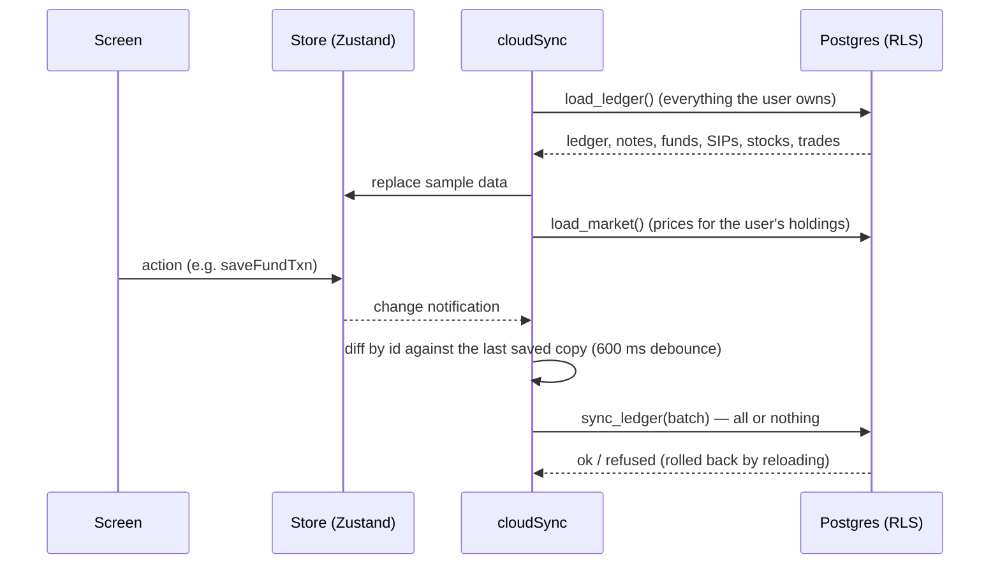
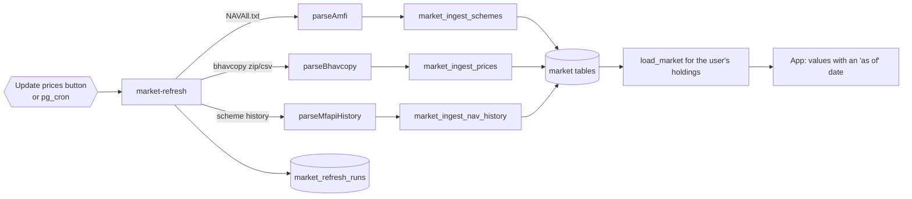

# Architecture (October 2026)

How the Command Center is built today, why, and how it grows. The phase order is in
[`ROADMAP.md`](ROADMAP.md); decisions are recorded one per file in [`decisions/`](decisions/README.md);
the original audit is in [`MODERNIZATION_PLAN.md`](MODERNIZATION_PLAN.md) (historical).

## 1. What it is

A personal command center for one owner (Devabalan): expenses and budgets, people and splits,
notes, mutual funds and stocks today; goals, other assets and personal trackers next. One Expo
codebase runs on the web (Vercel), iOS and Android. Supabase provides sign-in, the Postgres
database and server functions.

## 2. System context



- The browser only ever holds the **publishable** key and the user's own session. Every read and
  write goes through Row Level Security as that user.
- Anything that talks to a third party (market data today; notifications and password-protected
  statements later) runs in an **Edge Function** on the server, never in the app. Files you
  already hold (broker tradebooks) are read on your device; only the trades you approve are saved,
  through the same checks ([ADR 0009](decisions/0009-tradebook-import-on-device.md)).

## 3. The app (client)

```text
src/app/            routes only (Expo Router), ≤ 80 lines each
src/features/<x>/   screens, sheets and hooks of one area (expenses, notes, mutual-funds, stocks,
                    investments, overview, settings, auth, sync, shell)
src/features/*/state  Zustand stores: the in-memory copy screens read and change
src/lib/domain/<x>/ pure, tested rules: money, periods, budgets, FIFO, XIRR, SIPs (no React)
src/lib/data/       the only code that talks to Supabase (auth, MFA, RPCs, row mapping)
src/lib/files/      reading files on the device (.xlsx and .csv), no network
src/components/     design system: ui, layout, charts, overlays, feedback, icons
src/theme/          tokens, semantic colours (light/dark), motion, typography
```

Rules that keep it maintainable (enforced by ESLint and review):

- **Dependency direction:** routes → features → state → domain; data is called from state and
  hooks only. Domain code imports nothing from React or Supabase, so every calculation is a unit
  test away.
- **One store per area** (`expenseStore`, `notesStore`, `portfolioStore`, `marketStore`). Screens
  call store actions; they never call the database directly.
- **Size limits:** components ≤ 200 lines, routes ≤ 80. A file that grows is split.
- **No hard-coded data:** preview mode uses clearly labelled sample data (fictional names); signed
  in, only the user's data and server-provided market data are shown.

### Preview and signed-in modes

Without Supabase settings the app is a labelled **preview** (sample data, nothing saved). With
them, `/dashboard` requires a session; after sign-in `cloudSync` replaces every store with the
user's data before anything is shown.

## 4. Data and sync



- **One atomic batch** per change burst. Upserts by id, deletes last; splits and settles are
  replaced as a whole. Offline and server errors retry with back-off.
- **The database decides.** CHECK constraints, triggers and deferred constraint triggers enforce
  every rule the app checks (amount ranges, transfer accounts, category kinds, split totals, units
  and shares never going negative, SIP and fund matching). A refused batch changes nothing.
- **Money** is integer paise; fund units and NAVs are exact decimals with 4 places (calculations
  use integer ten-thousandths of a unit). Dates are calendar dates. See
  [ADR 0005](decisions/0005-money-units-and-dates.md).

**Known limit and its path:** the whole dataset loads at sign-in. That is fine for years of
personal data (thousands of rows), and the plan is incremental sync (`updated_at` cursors and
tombstones), loading an area on first visit, and monthly aggregates for reports when it is
needed ([ROADMAP](ROADMAP.md) Platform track).

## 5. Database

| Group       | Tables                                                                                                 | Who can write                                                 |
| ----------- | ------------------------------------------------------------------------------------------------------ | ------------------------------------------------------------- |
| Identity    | `profiles`, `user_preferences`, `audit_logs`; `internal.auth_allowlist`                                | The owner (own rows); audit log append-only                   |
| Ledger      | `accounts`, `categories`, `people`, `transactions`, `transaction_splits`, `repayment_settles`, `notes` | The owner, own rows only                                      |
| Investments | `mf_funds`, `mf_sips`, `mf_transactions`, `stocks`, `stock_trades`                                     | The owner, own rows only                                      |
| Market data | `mf_schemes`, `mf_nav_history`, `securities`, `security_prices`, `market_refresh_runs`                 | Only the `market-refresh` function (service role); users read |

Every user-owned table uses one template (`internal.secure_user_table`): owner defaults to the
caller and cannot change, composite foreign keys (a row can never point at another user's row),
per-verb RLS, a **restrictive** policy that requires the two-step code (aal2) once it is turned
on, audit entries naming changed columns (never values), and `updated_at` triggers.

## 6. Market data pipeline



- **Sources:** AMFI's daily NAV file (official, all schemes); the exchange end-of-day file
  (NSE, BSE as a fallback): end of day only, because there is no free official live-quote service;
  mfapi.in for older NAVs of held schemes (charts only). See
  [ADR 0004](decisions/0004-market-data-on-the-server.md).
- **Freshness is visible:** every run is logged; screens show "NAVs as of …" with the source,
  and a manual NAV or price can always override a missing one.
- **Safety:** callers are the schedule (shared secret, constant-time compare) or a signed-in user
  (token checked with Auth; at most every 30 minutes). Parsers keep only rows they recognise and a
  run with too few rows is marked failed, so a format change never writes bad prices.
- **Storage stays small:** NAV and price history is stored only for schemes and shares someone
  holds; the full lists keep only the latest value.

## 7. Security model

- Server-enforced authorization only: RLS, constraints and RPCs (all `security invoker`, empty
  `search_path`). Screens and route guards are convenience.
- Sign-up allowlist hook; TOTP two-step sign-in with aal2 enforced in the database; sessions in
  `sessionStorage` by default (`localStorage` only when "keep me signed in"), SecureStore on phones;
  idle sign-out.
- No secrets in the client or the repository. The service role lives only in Edge Functions; the
  schedule secret only in function secrets and Vault.
- Headers on Vercel: CSP (connect only to Supabase), HSTS, frame blocking, no referrer leaks.
- Logs and audit entries never contain amounts, notes, tokens or keys.
- We do not claim the app cannot be hacked; we reduce risk and test the controls (see the
  threat-model work in the Hardening track).

## 8. Quality

| Layer                 | How it is checked                                                                                                                |
| --------------------- | -------------------------------------------------------------------------------------------------------------------------------- |
| Domain rules          | Jest unit tests (money, periods, budgets, FIFO, XIRR, SIPs, validation)                                                          |
| Screens and sheets    | React Native Testing Library component tests                                                                                     |
| Data mapping and sync | Jest tests with mocked fetch                                                                                                     |
| Edge Functions        | `deno test` with the network and database replaced by fakes; `deno check`, `deno lint`                                           |
| Database              | SQL tests run against a fresh Postgres before a migration ships (kept out of the repository by the owner's choice, October 2026) |
| Delivery              | CI on every PR: typecheck, lint, format, tests, web build, bundle ceiling, Deno checks                                           |

## 9. Deployment

- **Web:** Vercel project `devabalan-command-center`, root `apps/command-center`, `vercel.json`
  (build, SPA rewrites, security headers). Public settings are the two `EXPO_PUBLIC_` variables.
- **Database:** SQL migrations in `supabase/migrations`, run in order in the SQL editor.
- **Edge Functions:** `supabase/functions`, deployed by the `Deploy Edge Functions` workflow when
  its two secrets are set, or with the Supabase CLI.
- **Phones (later):** EAS builds and updates from the same codebase.

## 10. How new modules are added

Every new area (goals, other assets, habits, health…) follows the same recipe, so the app grows
without new patterns:

1. A migration with its tables through `internal.secure_user_table`, CHECKs for every rule, and
   the new keys in `load_ledger` / `sync_ledger` (or its own RPC pair once incremental sync lands).
2. A domain folder with pure rules and tests.
3. Row mapping in `src/lib/data`, a store in the feature's `state/`, and its sample seed.
4. Screens built from the design system; a route file under `src/app/dashboard`.
5. Docs: a feature page under `docs/features/`, an ADR for any new decision, the roadmap updated.
