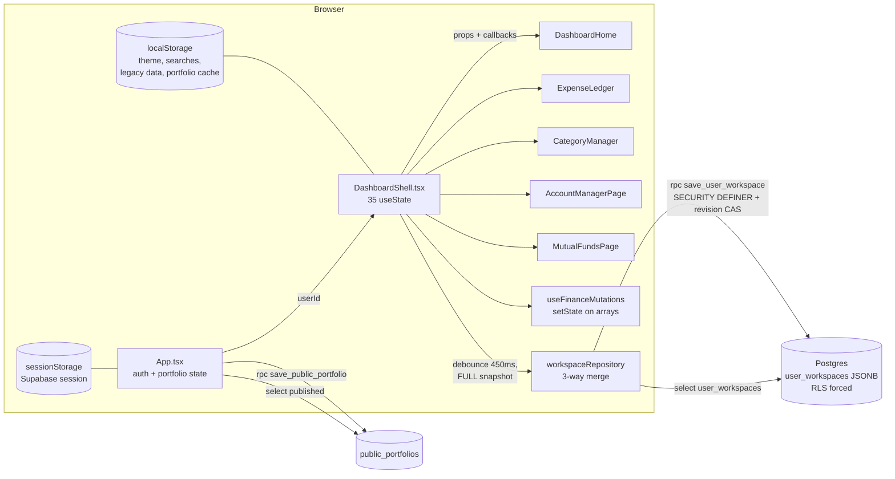
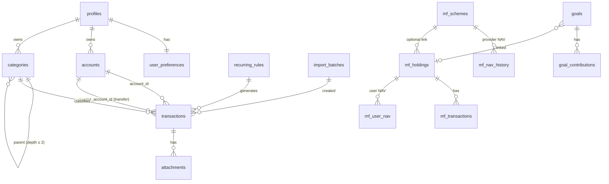
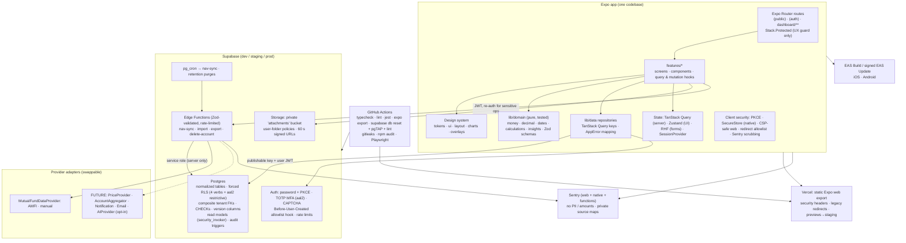

# DEVABALAN Personal Command Center: Audit, Target Architecture, and Phased Migration Plan

> Status: **PLAN ONLY.** No application code, schema, or configuration has been changed.
> Audited commit: `000d63e` (branch `claude/funny-clarke-necgkn`), 2026-10-07.
> Scope: every file under `src/`, `supabase/`, `public/`, the root configuration files, and the four existing Markdown guides.

---

## 1. EXECUTIVE SUMMARY

**The most important finding: the repository is not an Expo or React Native app today.** It is a **Vite 8 + React 19.3 + React Router 7 web single-page app** with plain CSS. It is deployed to Vercel and Netlify as a static bundle. Moving to "React Native + Expo + Expo Router" therefore means **re-platforming the UI layer, not refactoring it**. About 4,500 lines of CSS and every DOM-based component (`<dialog>`, `<select>`, `<table>`, `<svg>` in the DOM, `window.confirm`, `localStorage`) must be rebuilt using React Native primitives.

The **domain logic, Supabase security posture, and data-safety ideas are worth keeping**. They can be ported almost as-is:

- Owner-only RLS that is enabled and forced, revoked grants, and revision-checked (compare-and-swap) writes.
- A three-way merge for conflicting edits, explicit consent before importing legacy local data, and an allowlist for post-login redirects.
- Validating the session with `getUser()` before private data loads, and a client guard that refuses service-role keys.
- Normalizer and validator functions, calculation functions, the quick-add parser, and the calendar heat map concept.

What blocks a premium, long-lived product:

1. **The data model is one JSONB blob per user** (`user_workspaces`). Every edit re-uploads the whole workspace, which slows down as history grows. The database cannot enforce invariants, aggregate data, or produce reports. Categories are linked to transactions **by name**, not by ID.
2. **`DashboardShell.tsx` (309 lines) is a god component.** It holds 35 `useState` hooks covering routing, sync, modals, the transaction form, navigation, theme, and search.
3. **Financial correctness bugs exist today** (§3.5): bank balances ignore credit-card bill payments, average NAV is a simple mean, category edits can flip expense transactions to income, and dates are mixed between UTC and local time.
4. **Money uses JavaScript floats** everywhere.
5. **There are no tests, linting, CI, security headers, MFA, or rate limiting** beyond Supabase defaults.
6. **The CSS is an 11-file override stack** with 140+ `!important` declarations. None of it carries over to React Native anyway.

**Recommendation:** an incremental, **parallel-run migration**.

1. **Phases 1–3:** Build the new Expo app in `apps/command-center/` (it replaces the root once at parity) and normalize the database **while the current Vite app keeps working** against the same Supabase project. A read-compatible JSONB-to-tables migration and a `data_model_version` flag make this possible.
2. **Phases 4–9:** Ship the new experience feature by feature.
3. **Phases 10–12:** Harden, optimize, cut over the Vercel domain, and retire the Vite app and JSONB columns only after verified parity and a backup.

**Recommended stack** (justified in §4, §9, §13, §14, §25):

| Area | Choice |
|---|---|
| Platform | Expo (latest stable SDK at Phase 1 start; the SDK 58 docs list RN 0.88, React 19.2, RN Web 0.21) |
| Routing | Expo Router with `Stack.Protected`, plus headless `expo-router/ui` Tabs for the adaptive shell (sidebar on desktop, bottom bar on mobile) |
| Server state | TanStack Query |
| UI state | Zustand (a few small stores) |
| Forms and validation | React Hook Form + Zod (schemas shared with Edge Functions) |
| Charts | Custom chart kit on `react-native-svg` + `d3-scale`/`d3-shape`, behind a `charts/` abstraction |
| Motion and gestures | Reanimated + Gesture Handler |
| Money math | Postgres `numeric` as source of truth; integer paise for client cash math; `decimal.js-light` for NAV and units |
| Backend | Supabase Postgres (normalized, RLS, composite tenant FKs, audit triggers) + Edge Functions (NAV ingestion, import, export, account deletion) |
| Testing | Jest (`jest-expo`) + Testing Library, pgTAP (`supabase test db`), Playwright (web E2E) |
| CI | GitHub Actions |
| Monitoring | Sentry with PII scrubbing |

3D is **optional, deferred to Phase 8, lazy-loaded, and web-first with a 2D fallback**. It is not part of the core.

No claim is made that the system is "unhackable". §8 and §20 describe a defense-in-depth design and the tests that verify it.

---

## 2. CURRENT ARCHITECTURE

### 2.1 Current folder structure (as audited)

```
/
├── index.html                  Vite entry; Google Fonts; meta for the PUBLIC portfolio
├── vite.config.ts              react plugin + "@" alias
├── vercel.json                 SPA rewrite only (no headers)
├── public/_redirects           Netlify-style SPA rewrite (second host config)
├── public/profile.jpg, Devabalan-R-Resume.pdf
├── .env.example                VITE_SUPABASE_URL, VITE_SUPABASE_PUBLISHABLE_KEY
├── tsconfig.json               strict, noUnused*, TS 7.0.2
├── supabase/migrations/
│   ├── 202610040001_private_workspace.sql      user_workspaces (JSONB), RLS
│   ├── 202610040002_conflict_safe_workspace.sql revision + save_user_workspace RPC, public_portfolios
│   └── 202610040003_mutual_funds_workspace.sql  mutual_funds/fund_purchases JSONB + 6-arg RPC
├── README.md, SUPABASE_SETUP.md, APPLICATION_GUIDE.md, RUN_ON_ANOTHER_LAPTOP.md
└── src/
    ├── main.tsx / App.tsx                       BrowserRouter → app/App.tsx
    ├── app/
    │   ├── App.tsx (129)                        auth state, portfolio state, routes, idle timeout
    │   ├── DashboardShell.tsx (309)             EVERYTHING private: workspace sync, nav, modals, tx form
    │   └── dashboardRouting.ts                  path ↔ view map (allowlist)
    ├── features/
    │   ├── auth/      services/authService.ts, pages/DashboardAccess.tsx (sign-in),
    │   │              components/ProtectedRoute.tsx, SessionTimeoutPrompt.tsx, hooks/useSessionTimeout.ts
    │   ├── dashboard/ pages/DashboardHome.tsx (101)  "Insights" home: KPIs, 12-mo line, pie
    │   ├── finance/   model/{types,finance,defaultCategories,chartColors}.ts
    │   │              hooks/useFinanceMutations.ts (210)  all ledger mutations (FormEvent-driven)
    │   │              data/legacyFinanceStorage.ts         old localStorage keys
    │   │              pages/{ExpenseLedger(46 very long lines), CategoryManager(181), AccountManagerPage}
    │   │              components/{Calendar, Insights(UNUSED — not imported anywhere)}
    │   ├── stocks/    model/mutualFunds.ts, pages/MutualFundsPage.tsx (171)
    │   ├── portfolio/ public CV site + editor (model/data/components/pages)
    │   └── workspace/ data/workspaceRepository.ts   load/save/merge of JSONB snapshot
    └── shared/
        ├── lib/{supabaseClient.ts, preferencesStorage.ts}
        ├── components/TransactionDayContext.tsx
        └── styles/ 22 CSS files (~4,500 lines; dashboard.css imports 11 layered override files)
```

### 2.2 Current technology stack

| Concern | Today | Notes |
|---|---|---|
| Build/runtime | Vite 8.3.2, React 19.3.0, TypeScript 7.0.2, Node 22.19 | **Not Expo/RN.** Web only. |
| Routing | react-router-dom 7, `BrowserRouter`, hand-rolled view map | `/`, `/login`, `/dashboard/*` |
| State | `useState` in two god components; prop drilling | No server-state cache |
| Data | supabase-js 2.117.2; one JSONB row per user + RPC | Session in `sessionStorage` |
| Styling | Plain CSS, CSS custom properties, `data-theme` | 140+ `!important`; layered "fix" files |
| Charts | Hand-written SVG in components | No abstraction; duplicated scales and paths |
| Animation | framer-motion 14 | Respects `useReducedMotion` in places |
| Icons | lucide-react | |
| Forms/validation | Uncontrolled forms + `FormData` + ad-hoc checks + `normalize*` | No shared schema; no server-side content validation |
| Tests/lint/CI | **None** (`typecheck` script only) | |
| Deploy | Vercel (`vercel.json` rewrite) and Netlify (`_redirects`) | No security headers |

### 2.3 Current data flow



Every mutation goes through the same path: change in-memory arrays, wait 450 ms, serialize **all five collections**, call the RPC, and on a revision mismatch re-fetch, three-way merge, and retry up to four times. All aggregation (balances, monthly totals, MF returns) is recomputed in render functions from full arrays.

---

## 3. CURRENT PROBLEMS

### 3.1 What to preserve, refactor, or replace

| Preserve (port as-is or nearly) | Refactor | Replace |
|---|---|---|
| RLS posture: enable + **force** RLS, revoke from `public/anon`, per-verb policies | `normalize*` validators → Zod schemas (same rules) | Vite/React DOM UI → Expo/RN components |
| Revision-checked write idea → per-row optimistic concurrency (`version` column) | `finance.ts` / `mutualFunds.ts` calcs → tested `lib/calculations` with integer/decimal math | `user_workspaces` JSONB → normalized tables |
| Three-way merge semantics (as the *conflict UX*, not the storage model) | `useFinanceMutations` → per-entity mutation hooks over TanStack Query | `DashboardShell.tsx` god component → route layouts + feature hooks |
| Redirect allowlist (`dashboardViewFromPath`) → typed-route allowlist for `?redirect=` and deep links | Quick-add parser (`openQuickAdd`) → pure `parseQuickAdd()` + tests | 22 CSS files → TS design tokens + StyleSheet |
| Auth-version race guard in `App.tsx`; `getUser()` verification before private render | Calendar heat map, category drag/reorder UX, inline rename + undo | framer-motion → Reanimated |
| Client guard against `sb_secret_`/service-role keys in `supabaseClient.ts` | `useSessionTimeout` → platform-aware (AppState on native) | `window.confirm` → `ConfirmSheet` |
| Legacy-import **consent** screen ("never silently assign local data") | Portfolio feature → public route group of the same app | `sessionStorage` session → web: memory/session storage; native: SecureStore-backed adapter |
| URL sanitization in portfolio (`externalHref`) | Mutual-fund date canonicalization → explicit, audited one-time migration | Hand-rolled SVG charts → shared chart kit |
| Accessible focus trap, `aria-*` labelling patterns, reduced-motion checks | | |

### 3.2 Architecture

- **A1. God component.** `src/app/DashboardShell.tsx` owns routing, the sync engine, 35 `useState` hooks, the transaction form, two navigation systems, theme, toast, and the profile menu. Any feature change touches it.
- **A2. Whole-workspace persistence.** `saveWorkspace` sends every transaction, account, category, fund, and purchase on every change, and compares them with `JSON.stringify` (`DashboardShell.tsx:281-285`). Cost grows as O(total history) per keystroke-level edit.
- **A3. Identity by name.** Transactions store `category`/`subcategory` **names**. Renames rewrite every matching transaction (`useFinanceMutations.ts:752,766,789`). Subcategories are strings, not entities, so budgets, reports, and merges by ID are impossible.
- **A4. No server-side business rules.** The RPC only checks `jsonb_typeof = 'array'`. Any authenticated client can store arbitrary or unbounded JSON in its own row.
- **A5. Mutation on read.** `loadWorkspace` silently rewrites fund-purchase dates and saves them (`workspaceRepository.ts:339-354`). A read should never mutate financial history.
- **A6. Dead or duplicate code.** `features/finance/components/Insights.tsx` (100 lines) is never imported. There are three separate category-palette constants (`COLORS`, `categoryChartColors`, `PALETTE`, plus `categoryColors` inside `Insights`).
- **A7. Two deployment configs** (`vercel.json`, `public/_redirects`) and no single source of truth.
- **A8. Feature folder naming.** Mutual funds live under `features/stocks` even though no stock functionality exists.

### 3.3 UI

- **U1.** The CSS is a cascade of layered overrides (`dashboard.css` → `app.css`, `react.css`, `dashboard-classic.css` (1,224 lines), `black-surfaces.css`, `responsive-audit.css`, `app-mobile-fixes.css`…), with 54 `!important` in `dashboard-classic.css` alone. It is hard to reason about and impossible to port.
- **U2.** Colors are hard-coded in TS (`'#D97706'`, `'#111111'`, etc.) and CSS. There is no semantic income/expense/profit/loss token set shared by charts and text.
- **U3.** Several `<svg>` charts use `preserveAspectRatio="none"`, so text and dots stretch on wide screens. Labels collide on narrow screens. Pie callout positions are computed for a fixed 480 px width.
- **U4.** Gain and loss are partly conveyed only by color (`.positive`/`.negative` classes). Arrows and signs are present in some places but not consistently.

### 3.4 UX

- **X1.** Adding a transaction requires a modal with five dropdowns. The mobile reference (screenshots 1 and 3) shows a much faster pattern: a type segment, inline rows, and a category **grid sheet** with expandable subcategories.
- **X2.** There is no global search or command palette. Search is limited to the ledger's month.
- **X3.** There are no transfers between bank accounts, no refunds, and no recurring entries. "Card payment" is the only transfer-like type.
- **X4.** Mutual funds require manual NAV entry per fund. There is no scheme master, no redemptions, no SIP schedule, and no XIRR.
- **X5.** Destructive actions use `window.confirm` without undo, except for subcategory delete.
- **X6.** The "Stocks" area is a placeholder ("will be added later"). The product currently shows unfinished functionality in its main navigation.

### 3.5 Financial correctness (exact defects, must be fixed during migration)

| # | Defect | Location | Effect |
|---|---|---|---|
| F1 | Bank balances ignore `payment` (card bill paid from bank) | `finance.ts:445-467` (`openingBankBalance`, `accountBalance`), duplicated in `ExpenseLedger.tsx:258`, `DashboardHome.tsx:773` | **Bank balance is overstated by every card bill ever paid.** |
| F2 | `averageNav` = arithmetic mean of purchase NAVs | `mutualFunds.ts:547` (`calculateAverageNAV` exists but is unused) | Wrong for unequal SIP amounts; should be cost ÷ units. |
| F3 | P/L uses net amount (excluding stamp duty) as cost basis | `mutualFunds.ts:546` | Returns are slightly overstated; stamp duty is a real cost. Decide explicitly and label it. |
| F4 | `updateCategory` rewrites `type` on all transactions of a renamed or re-typed category | `useFinanceMutations.ts:752` | Changing a category's type silently converts expenses into income. |
| F5 | Mixed UTC and local "today" | `ExpenseLedger.tsx:243` uses `toISOString()` (UTC); elsewhere `dateKey` (local) | Between 00:00 and 05:30 IST, "Today/Yesterday" labels are wrong. |
| F6 | Purchase dates forced to the 1st of the month when order and execution dates differ | `MutualFundsPage.tsx:593`, `workspaceRepository.ts:339-354` | Destroys real execution dates, which breaks XIRR accuracy later. |
| F7 | Float arithmetic for all money sums | everywhere (`+=` on `number`) | Accumulated paise drift; display may differ from statements. |
| F8 | Units rounded to 3 dp on entry but not reconciled with the statement | `calculateUnitsAllotted` | Fine as an estimate; the statement value should be storable as authoritative. |

The reference screenshots (another expense app the user currently uses) contain "Credit card bill" and "Savings" as **expense** categories. If these are imported as expenses they **double count** spending: card spends plus the bill. Saving money is not an expense. The importer (Phase 9) must map them to `transfer` (§7).

### 3.6 Performance

- **P1.** A full snapshot upload plus a deep `JSON.stringify` comparison of every collection happens after each change.
- **P2.** O(n·m) loops: `accountBalance` scans all transactions per account per render. The ledger account pills compute every account's balance on every render. `monthlyPortfolioValue` sorts NAV history per fund per date.
- **P3.** No list virtualization. The ledger renders all month rows and the MF purchases table renders everything.
- **P4.** Three Google font families are loaded render-blocking for the private app too.

### 3.7 Security (exact weaknesses)

| ID | Weakness | Where | Severity |
|---|---|---|---|
| S1 | No HTTP security headers: no CSP, HSTS, `X-Frame-Options`/`frame-ancestors`, `Referrer-Policy`, `Permissions-Policy`, or `X-Content-Type-Options`. The private dashboard is framable (clickjacking) and any injected script runs unconstrained. | `vercel.json` | High |
| S2 | `SECURITY DEFINER` functions use `search_path = pg_catalog, public, auth`. Best practice is `search_path = ''` with fully qualified names, so that objects created in `public` can never shadow the functions' lookups. | migrations 0002, 0003 | Medium |
| S3 | The legacy 4-argument `save_user_workspace(bigint,jsonb,jsonb,jsonb)` is still granted to `authenticated`. This is unnecessary attack surface. | migration 0002 | Low |
| S4 | Unbounded JSONB payloads: an authenticated user can write arbitrarily large data (storage and egress abuse, slow queries). There are no size `CHECK`s. | `user_workspaces`, `public_portfolios` | Medium |
| S5 | `save_public_portfolio` lets **any authenticated user** create a published, publicly readable profile with any free slug. Account creation is restricted only by a manual dashboard toggle ("turn off sign-ups") that the database does not enforce. | migration 0002, `SUPABASE_SETUP.md` step 5 | Medium (High if sign-ups are re-enabled) |
| S6 | No MFA, no re-authentication for sensitive actions, no CAPTCHA, and no app-level rate limiting. The account is protected by a single password, subject to Supabase Auth default rate limits only. | auth feature | High for a finance app |
| S7 | supabase-js uses the default (implicit) auth flow with `detectSessionInUrl: true`. PKCE is recommended for any email-link or OAuth flows that are added. | `supabaseClient.ts` | Low today, Medium later |
| S8 | No audit trail for sign-ins, deletions, or financial edits beyond Supabase's internal auth log. | DB | Medium |
| S9 | The idle timeout is client-side only. Server refresh tokens remain valid until the Supabase session settings expire them. | `useSessionTimeout.ts` | Low (acceptable as UX; add server time-box) |
| S10 | `profileImage` and resume paths accept any URL. The public page can be made to load third-party trackers (no CSP `img-src` restriction). | portfolio | Low |
| S11 | Personal phone and email are hard-coded in the client bundle (`DEFAULT_PORTFOLIO`). This is intentional public data, but it should be a deliberate privacy choice, not a fallback default. | `portfolio/model/portfolio.ts` | Info |
| S12 | No dependency or secret scanning, no CI, and no RLS tests. Policies are verified only manually (`SUPABASE_SETUP.md` "Verification"). | repo | Medium |
| S13 | `localStorage` retains `devabalan.portfolio.v1` and recent searches. Search terms may contain financial notes that persist on shared devices. | `preferencesStorage.ts` | Low |

**Verified as done well:** RLS is forced; `revoke all … from public, anon, authenticated` precedes grants. RPCs derive `user_id` from `auth.uid()` and never from parameters. The client verifies `user.id === userId` before writes, refuses secret keys, and sanitizes portfolio links to `http(s)`. There is no `dangerouslySetInnerHTML`, `innerHTML`, or `eval` anywhere in `src/`.

### 3.8 Scalability and extensibility

- Adding any new entity (goals, SIPs, tags) currently means adding another JSONB column, extending the RPC signature, the merge function, the snapshot type, and the god component. That is five coupled edits.
- No server aggregation means reports over years of data require downloading everything.

### 3.9 What will fail when moved to Expo

| On web (RN Web) | On Android/iOS |
|---|---|
| All CSS files (RN Web uses StyleSheet, not global CSS) | `window`, `document`, `localStorage`, `sessionStorage`, `crypto.randomUUID` (use `expo-crypto`) |
| `<dialog>`, `<table>`, `<select>`, `<details>`, `type="date"` inputs | `window.confirm`, `URL.createObjectURL` + `<a download>` (use `expo-sharing`/`expo-file-system`) |
| framer-motion `motion.*` DOM elements | HTML5 drag-and-drop in `CategoryManager` (use Gesture Handler) |
| `title=` hover tooltips (replace with `Tooltip` component) | Hover-only interactions (double-click to rename) need long-press or menu equivalents |
| | `import.meta.env.VITE_*` → `process.env.EXPO_PUBLIC_*` |

---

## 4. TARGET ARCHITECTURE

### 4.1 Layers

```
┌──────────────────────────────────────────────────────────────────────┐
│ app/ (Expo Router routes: thin; compose features; no business logic) │
├──────────────────────────────────────────────────────────────────────┤
│ features/<domain>/  components · hooks (queries/mutations) · screens │
├──────────────────────────────────────────────────────────────────────┤
│ components/ (design system: ui · layout · charts · forms · feedback) │
├──────────────────────────────────────────────────────────────────────┤
│ lib/domain: calculations · money · dates · insights · validation(Zod)│  ← pure, platform-free, 100% unit-tested
├──────────────────────────────────────────────────────────────────────┤
│ lib/data: repositories (Supabase) · providers (adapters) · queryKeys │
├──────────────────────────────────────────────────────────────────────┤
│ Supabase: Postgres (RLS, constraints, RPC, views) · Auth · Storage · │
│ Edge Functions (privileged: NAV ingest, import, export, delete-acct) │
└──────────────────────────────────────────────────────────────────────┘
```

Rules:

- `lib/domain` imports nothing from React, React Native, or Supabase.
- Screens never call `supabase` directly. Only repositories do.
- Every Postgres write that crosses entities (transfer, import, migration, account deletion) is **one RPC in one transaction**.

### 4.2 Key technology decisions

| Decision | Choice | Alternatives considered | Why | Web impact | Mobile impact | Scalability |
|---|---|---|---|---|---|---|
| Platform | **Expo, latest stable SDK** (`npx expo install` pins compatible versions) | Keep Vite web + separate RN app; Capacitor wrapper of current web app | Required by brief; one codebase; EAS builds/updates | RN Web output; static export for public pages | Native performance, SecureStore, haptics | Single code path for features |
| Routing | **Expo Router** (file routes, typed routes, `Stack.Protected`, `expo-router/ui` headless Tabs) | React Navigation directly | URLs = deep links; protected groups; headless tabs allow sidebar↔bottom bar from one tree | Real browser URLs, back button | Universal/deep links | New modules = new folders |
| Server state | **TanStack Query** | RTK Query, SWR, Supabase realtime-only | Caching, retries, invalidation, optimistic updates, devtools; platform-agnostic | Same | Same; `focusManager` wired to AppState | Query keys per feature |
| UI state | **Zustand** (sidebar, command palette, quick-add draft, dashboard edit mode) | Context only; Redux | Tiny, no provider pyramid, selector-based renders | — | — | One store per concern |
| Forms | **React Hook Form + Zod** | Formik; hand-rolled | Uncontrolled perf on RN; Zod schemas reused in Edge Functions (Deno `npm:zod`) | — | — | Shared validation contract |
| Styling | **StyleSheet + typed tokens + `useTheme()`/`useBreakpoint()`** | NativeWind, Tamagui, Unistyles | Zero lock-in, no compiler, easy to hand over; upgrade path to Unistyles if theme-switch re-render cost is *measured* to be a problem | Works with RN Web | Native | Tokens are the contract |
| Charts | **react-native-svg + d3-scale/d3-shape**, own `components/charts` | victory-native XL (Skia; ~2.9 MB CanvasKit on web), react-native-gifted-charts, ECharts in WebView | Current charts are already SVG (direct port); small bundle; SVG is accessible on web; abstraction allows swapping to Skia for heavy charts later | Native SVG DOM, crisp, accessible | Fine for < ~2k points per chart (measure) | Swap per-chart behind interface |
| Animation | **Reanimated + Gesture Handler** | framer-motion (web only), Moti | Standard Expo stack; UI-thread animations; swipe actions | Supported | Supported | — |
| Lists | **FlatList first**; FlashList only if profiling shows jank | FlashList everywhere | Measure first (brief rule) | — | — | Cursor pagination from DB |
| Money | **Postgres `numeric`**; client `Money` = integer paise; `decimal.js-light` for NAV×units | Floats; `dinero.js`; bigint everywhere | Exactness without heavy deps (~12 KB) | — | — | Central `lib/domain/money` |
| Dates | **date-fns** + `Intl`; DB `date` for calendar dates, `timestamptz` for events | dayjs, moment | Tree-shakable, immutable | — | — | Timezone from profile |
| Auth storage | Web: **in-memory + sessionStorage** (keep current posture); Native: **SecureStore-encrypted adapter** (key in SecureStore, ciphertext in AsyncStorage, because SecureStore values are size-limited) | AsyncStorage plain | Tokens never in plain storage on device | — | Keychain/Keystore | — |
| Icons | **lucide-react-native** | @expo/vector-icons | Visual parity with current lucide-react | — | — | — |
| Bottom sheets | **`Sheet` component**: native → `@gorhom/bottom-sheet` v5; web → `Sheet.web.tsx` (dialog/side drawer) | gorhom everywhere | Desktop web wants dialogs and drawers, not bottom sheets | Better desktop UX | Native-feel sheets | One API |
| Monitoring | **Sentry** (`@sentry/react-native`, Expo plugin) with scrubbing | LogRocket, none | Covers web + native + source maps privately | — | — | — |
| Tests | **jest-expo + RNTL, pgTAP, Playwright** | Vitest (weak RN support), Detox | Official Expo path; Chromium already in CI images | — | Maestro later for native E2E | — |

---

## 5. TARGET FOLDER STRUCTURE

```
/
├── app.config.ts                    # reads EXPO_PUBLIC_* only; scheme "devabalan"; web.output "static"
├── eas.json                         # development / preview / production profiles
├── vercel.json                      # buildCommand, outputDirectory "dist", headers (CSP etc.), legacy redirects
├── .env.example                     # EXPO_PUBLIC_SUPABASE_URL, EXPO_PUBLIC_SUPABASE_PUBLISHABLE_KEY, EXPO_PUBLIC_SENTRY_DSN
├── jest.config.js, playwright.config.ts, eslint.config.js, .prettierrc
├── .github/workflows/{ci.yml, db.yml, security.yml}
├── supabase/
│   ├── config.toml
│   ├── migrations/                  # existing 3 kept untouched + new numbered migrations (§24)
│   ├── seed.sql                     # LOCAL ONLY: two test users, fake data
│   ├── tests/                       # pgTAP: rls_*.test.sql, constraints_*.test.sql, rpc_*.test.sql
│   └── functions/
│       ├── _shared/{cors.ts, auth.ts, rateLimit.ts, schemas.ts (zod), errors.ts}
│       ├── nav-sync/                # scheduled: provider → mf_nav_history (service role)
│       ├── import-transactions/     # validate → preview → commit (transactional RPC)
│       ├── export-data/             # CSV/JSON export, signed URL, short TTL
│       └── delete-account/          # re-auth required; cascades; storage cleanup
├── docs/{architecture/, adr/, runbooks/}
└── src/
    ├── app/                         # ROUTES ONLY (see §6)
    ├── components/
    │   ├── ui/          Text, Heading, Money, Delta, Button, IconButton, Card, Badge, Chip, Avatar,
    │   │                Divider, Skeleton, Tooltip, Menu, SegmentedControl, Tabs, ProgressBar, ProgressRing
    │   ├── layout/      Screen, AppShell, Sidebar, BottomBar, TopBar, Grid, Stack, Section, ResponsiveSplit
    │   ├── navigation/  NavItem, NavGroup, Breadcrumbs, CommandPalette(.web), SearchScreen
    │   ├── forms/       Field, TextField, AmountField, DateField(.web), SelectSheet, CategoryPicker,
    │   │                AccountPicker, Switch, FormError
    │   ├── feedback/    Toast(+Undo), EmptyState, ErrorState, OfflineBanner, ConfirmSheet, SuccessCheck
    │   ├── overlays/    Sheet(.web), Modal, Drawer
    │   └── charts/      ChartFrame, AreaChart, LineChart, BarChart, StackedBar, Donut, RadialProgress,
    │                    Sparkline, Waterfall, AllocationBar, ChartTooltip, ChartSummary (a11y text),
    │                    scales.ts, types.ts
    ├── features/
    │   ├── auth/            screens, hooks/useSession, services/authService, mfa/
    │   ├── dashboard/       widgets/registry.ts, widgets/*, hooks/useDashboardLayout
    │   ├── transactions/    components/(TransactionRow, QuickAdd, TransactionForm), hooks, screens
    │   ├── accounts/
    │   ├── categories/
    │   ├── budgets/         (PREMIUM-READY)
    │   ├── investments/     mutual-funds/ (holdings, transactions, nav, sips), allocation/
    │   ├── goals/           (PREMIUM-READY)
    │   ├── insights/        rules/*.ts (pure), hooks/useInsights
    │   ├── reports/
    │   ├── search/
    │   ├── notifications/   (PREMIUM-READY)
    │   ├── import-export/
    │   ├── settings/        profile, preferences, security, sessions, privacy, data
    │   └── portfolio/       public CV (existing feature, ported)
    ├── lib/
    │   ├── domain/
    │   │   ├── money.ts           # paise int, parse/format boundary, sum, allocate
    │   │   ├── decimal.ts         # decimal.js-light wrapper for NAV/units
    │   │   ├── dates.ts           # todayIn(tz), monthRange, isoDate guards
    │   │   ├── calculations/      # balances, cashflow, savingsRate, netWorth, categoryTotals,
    │   │   │                      # portfolio (value, costBasis FIFO, realized/unrealized), cagr, xirr,
    │   │   │                      # allocation, goalProgress, trends, healthScore
    │   │   ├── insights/          # rule engine (pure)
    │   │   ├── quickAdd.ts        # parser ported from DashboardShell.openQuickAdd
    │   │   └── schemas/           # Zod: transaction, account, category, mfTransaction, import rows…
    │   ├── supabase/{client.ts, storage.native.ts, storage.web.ts, types.gen.ts}
    │   ├── data/                  # repositories: transactions.ts, accounts.ts, … queryKeys.ts
    │   ├── providers/             # interfaces + adapters (MarketData, MutualFund, Notification, AI, Email)
    │   ├── security/{redirects.ts (allowlist), reauth.ts, sanitize.ts}
    │   ├── formatting/{currency.ts, number.ts, date.ts, percent.ts}
    │   ├── observability/{sentry.ts, logger.ts (scrubbing)}
    │   └── platform/{haptics.ts, share.ts, download(.web).ts}
    ├── state/                     # zustand: ui.ts, commandPalette.ts, quickAdd.ts
    ├── theme/{tokens.ts, light.ts, dark.ts, semantic.ts, typography.ts, motion.ts, breakpoints.ts, ThemeProvider.tsx}
    ├── hooks/{useBreakpoint.ts, useReducedMotion.ts, useKeyboardShortcut(.web).ts, useOnline.ts}
    ├── constants/
    └── types/
```

Size rules (enforced in review and ESLint `max-lines`): route files ≤ 80 lines, components ≤ 200 lines, one exported component per file, and no JSX line over 120 characters.

---

## 6. ROUTING ARCHITECTURE

The public portfolio stays at `/`, so the private app keeps a real `dashboard` path segment (route groups add no URL segment).

```
src/app/
├── _layout.tsx                       # Providers: Theme, QueryClient, Session, GestureHandler, Sentry, ErrorBoundary
├── +not-found.tsx
├── +html.tsx                         # web document: lang, meta, preload Inter; NO inline scripts (CSP)
├── +native-intent.tsx                # sanitize incoming deep links (allowlist) before routing
├── (public)/
│   ├── _layout.tsx
│   ├── index.tsx                     # Portfolio (existing feature) — statically rendered for SEO
│   └── privacy.tsx
├── (auth)/
│   ├── _layout.tsx                   # Stack.Protected guard={!session}
│   ├── sign-in.tsx                   # replaces /login
│   ├── forgot-password.tsx
│   ├── reset-password.tsx            # PKCE code exchange
│   ├── mfa.tsx                       # TOTP challenge (aal1 → aal2)
│   └── sign-up.tsx                   # FEATURE-FLAGGED OFF (personal app; signups blocked server-side)
└── dashboard/
    ├── _layout.tsx                   # Stack.Protected guard={session && aal OK}; AppShell (headless Tabs)
    ├── index.tsx                     # Command center
    ├── transactions/
    │   ├── index.tsx                 # ledger: list | calendar | insights (view param ?view=calendar)
    │   ├── [id].tsx                  # detail (inline edit, attachments later)
    │   └── new.tsx                   # presentation: modal (sheet on mobile, dialog on desktop); ?type=&date=
    ├── accounts/{index.tsx, [id].tsx}
    ├── categories/index.tsx
    ├── budgets/index.tsx             # PREMIUM-READY
    ├── investments/
    │   ├── index.tsx                 # portfolio overview (all asset types; MF only initially)
    │   └── mutual-funds/
    │       ├── index.tsx             # holdings
    │       ├── [holdingId].tsx       # fund detail: NAV chart, lots, transactions, XIRR
    │       ├── transactions/new.tsx  # modal: purchase / redemption / switch / SIP instalment
    │       └── sips.tsx              # PREMIUM-READY
    ├── goals/{index.tsx, [id].tsx}   # PREMIUM-READY
    ├── insights.tsx
    ├── reports/{index.tsx, [reportId].tsx}
    ├── search.tsx                    # mobile search screen (desktop uses palette overlay)
    ├── notifications.tsx             # PREMIUM-READY
    ├── portfolio-editor.tsx          # existing editor
    └── settings/
        ├── index.tsx, profile.tsx, preferences.tsx
        ├── security.tsx              # password, MFA, re-auth gated
        ├── sessions.tsx              # devices; sign out others
        ├── privacy.tsx               # AI opt-in (off), data minimization toggles
        └── data.tsx                  # import / export / delete account
```

**Navigation model** (`dashboard/_layout.tsx` using `expo-router/ui` `Tabs` + `TabSlot` + custom `TabList`):

| Width | Primary nav | Secondary |
|---|---|---|
| ≥ 1024 (desktop) | Collapsible left **Sidebar** (Dashboard, Transactions, Accounts, Investments, Goals, Insights, Reports; footer: Settings, profile) | TopBar: search trigger (⌘K), Quick add, notifications, theme |
| 768–1023 (tablet) | Icon-rail sidebar (auto-collapsed), expands on hover/press | Same TopBar |
| < 768 (mobile) | **BottomBar**: Home · Transactions · ＋ (center FAB → quick add sheet) · Investments · More | Compact header; "More" lists Accounts, Goals, Insights, Reports, Settings |

**Legacy URL redirects** (`vercel.json` 308 redirects plus `+native-intent`):

| Old URL | New URL |
|---|---|
| `/login` | `/sign-in` |
| `/dashboard/finance/expense` | `/dashboard/transactions` |
| `/dashboard/finance/accounts` | `/dashboard/accounts` |
| `/dashboard/finance/categories` | `/dashboard/categories` |
| `/dashboard/stock` | `/dashboard/investments` |
| `/dashboard/stock/mutual-funds` | `/dashboard/investments/mutual-funds` |
| `/dashboard/portfolio` | `/dashboard/portfolio-editor` |

**Redirect safety:** `?redirect=` after sign-in must pass `lib/security/redirects.ts`. It allows only same-origin, relative paths matching a typed route allowlist, which ports the current `dashboardViewFromPath` check. External URLs, `//host`, `javascript:` and backslash variants are rejected and covered by tests.

**Error and loading boundaries:** each route group exports an `ErrorBoundary`, and screens use skeletons rather than full-page spinners.

**The navigation guard is UX only.** RLS and RPC checks are the authorization boundary.

---

## 7. DATABASE ARCHITECTURE

### 7.1 Principles

- UUID PKs (`gen_random_uuid()`). Every user-owned row has `user_id uuid not null default auth.uid() references auth.users on delete cascade`.
- **Composite tenant FKs** prevent cross-user references (IDOR at the data level). Every user-owned table has `unique (user_id, id)`, and children reference `(user_id, account_id) → accounts(user_id, id)`. With this, a forged `account_id` belonging to someone else fails the FK even if RLS somehow allowed the insert.
- Money is `numeric(14,2)` with `check (amount > 0)`; direction comes from `kind`, never from the sign. NAV is `numeric(16,4)` and units are `numeric(18,4)`.
- Calendar dates are `date` (`occurred_on`); event times are `timestamptz`.
- `created_at`, `updated_at` (trigger), and `version int` for optimistic concurrency (replaces the workspace `revision`).
- Soft delete (`deleted_at`) on transactions, enabling undo; a 30-day purge job hard-deletes. Hard delete applies everywhere else.
- `source` enum `('manual','import','recurring','provider','migration')` and `client_id uuid` (idempotency key; `unique (user_id, client_id)`) on writes.
- Text length `CHECK`s on every text column (e.g. `char_length(description) between 1 and 120`). JSONB columns get `pg_column_size(...) < N` checks.

### 7.2 Entities (CORE / PREMIUM-READY / FUTURE)

| Table | Tier | Key columns / invariants | Derived from current |
|---|---|---|---|
| `profiles` | CORE | `id = auth.users.id`, `display_name`, `base_currency char(3) default 'INR'`, `timezone text default 'Asia/Kolkata'`, `data_model_version smallint` | new |
| `user_preferences` | CORE | `user_id pk`, `theme`, `reduced_motion`, `dashboard_layout jsonb` (size + schema checked), `privacy_ai_opt_in bool default false` | `localStorage` theme |
| `accounts` | CORE | `kind enum(bank, cash, credit_card, wallet, loan, investment)`, `name`, `opening_balance numeric(14,2)`, `opening_date`, `currency`, `include_in_net_worth bool`, `archived_at`, `sort_order`; unique `(user_id, lower(name)) where archived_at is null` | `Account {bank, credit}` |
| `categories` | CORE | `kind enum(expense, income)`, `parent_id` (self FK, same user via composite FK), `name`, `icon`, `color`, `sort_order`, `archived_at`; unique `(user_id, kind, coalesce(parent_id, nil), lower(name))`; trigger: child kind = parent kind, depth ≤ 2 | `Category` + string `subcategories[]` |
| `transactions` | CORE | `kind enum(expense, income, transfer, refund, adjustment)`, `amount`, `occurred_on`, `account_id`, `counter_account_id`, `category_id`, `description`, `note`, `merchant`, `source`, `client_id`, `import_batch_id`, `recurring_rule_id`, `deleted_at`, `version`. CHECKs: transfer ⇒ counter account set, ≠ account, category null; expense/income/refund ⇒ counter account null; refund ⇒ expense category | `Transaction {expense, income, payment}`; `payment` → `transfer` |
| `budgets` | PREMIUM-READY | `category_id`, `period enum(monthly)`, `amount`, `starts_on` | `Category.monthlyBudget` |
| `tags`, `transaction_tags` | PREMIUM-READY | unique `(user_id, lower(name))` | — |
| `transaction_splits` | FUTURE | sum of splits = parent amount (deferred constraint trigger) | — |
| `attachments` | PREMIUM-READY | `transaction_id`, `storage_path` (`{user_id}/{uuid}`), `mime`, `bytes ≤ 10 MB`, `sha256` | — |
| `recurring_rules` | PREMIUM-READY | RRULE subset (`freq`, `interval`, `by_month_day`), `next_occurs_on`, template fields, `ends_on` | — |
| `goals`, `goal_contributions` | PREMIUM-READY | `target_amount`, `target_date`, `linked_account_id`/`linked_holding_id` | — |
| `mf_schemes` | CORE (reference, global) | `scheme_code unique`, `isin`, `amc`, `name`, `category`, `plan enum(direct, regular)`, `option enum(growth, idcw_payout, idcw_reinvest)`, `provider`, `updated_at`. **No `user_id`**; `select` to authenticated; writes service role only | — |
| `mf_nav_history` | CORE (reference, global) | PK `(scheme_id, nav_date)`, `nav numeric(16,4)`, `provider` | — |
| `mf_holdings` | CORE | `user_id`, `scheme_id` (nullable for custom/unmatched funds), `custom_name`, `custom_category`, `folio_ref`, `expense_ratio`, `exit_load_note`, `investment_account_id` | `MutualFund` |
| `mf_user_nav` | CORE | `(holding_id, nav_date)`, `nav`, `source='user'`. User-entered NAV is kept separate from provider NAV | `MutualFund.navHistory`, `currentNav` |
| `mf_transactions` | CORE | `holding_id`, `kind enum(purchase, sip_purchase, redemption, switch_in, switch_out, idcw_payout, idcw_reinvest)`, `order_date`, `nav_date`, `amount`, `stamp_duty`, `nav`, `units`, `units_source enum(statement, calculated)`, `switch_pair_id`; CHECK on units sign by kind | `FundPurchase` (`purchasedDate` → `order_date`, `executionDate` → `nav_date`) |
| `sips` | PREMIUM-READY | `holding_id`, `amount`, `day_of_month`, `starts_on`, `ends_on`, `status` | — |
| `notifications` | PREMIUM-READY | `channel enum(info, financial, security)`, `title`, `body`, `read_at`, `dedupe_key` | — |
| `insights_cache` | FUTURE | Insights start as pure client functions; persist only if needed | — |
| `import_batches` | PREMIUM-READY | `status enum(previewed, committed, rolled_back)`, `row_count`, `error_report jsonb (size-capped)`, `file_sha256` | — |
| `audit_logs` | CORE | append-only: `actor_id`, `action`, `entity`, `entity_id`, `changed_fields text[]`, `ip_hash`, `created_at`. **No amounts or notes stored** | — |
| `rate_limits` | CORE (internal schema) | `(key, window_start)` counters used by Edge Functions | — |
| `public_portfolios` | CORE (kept) | add `char_length`/`pg_column_size` checks; owner gate (§8) | existing |
| `user_workspaces` | LEGACY | read-only after migration; dropped in Phase 12 after backup | existing |

### 7.3 Relationships



### 7.4 Read models (server-side aggregation)

These are views with `security_invoker = true`, so RLS applies, or `STABLE` SQL functions:

- `v_account_balances(as_of)`: balance per account using **correct transfer semantics**. A transfer subtracts from the source and adds to the destination; for credit cards, an expense increases outstanding and a transfer in decreases it. This fixes F1.
- `f_monthly_cashflow(from, to)`: income, expense, and net per month. Transfers are excluded and refunds net against expenses.
- `f_category_totals(from, to, kind)` with parent rollup.
- `v_mf_positions`: units, cost basis (FIFO; gross including stamp duty, fixing F3), latest NAV with precedence provider > user (and its date), current value.
- Client calculations (`lib/domain/calculations`) **mirror** these functions and are tested against the same fixtures, so screen-level aggregates and server aggregates cannot drift.

### 7.5 Indexes

- `transactions (user_id, occurred_on desc) where deleted_at is null`
- `transactions (user_id, account_id, occurred_on)`
- `transactions (user_id, category_id, occurred_on)`
- `transactions using gin (to_tsvector('simple', description || ' ' || coalesce(note,'') || ' ' || coalesce(merchant,'')))`, for global search
- `mf_transactions (user_id, holding_id, nav_date)`
- `mf_nav_history (scheme_id, nav_date desc)`
- `audit_logs (actor_id, created_at desc)`
- A partial unique index on `client_id`

---

## 8. SECURITY ARCHITECTURE

### 8.1 Authentication (Supabase Auth)

- Email + password with **PKCE flow**. Password reset uses the PKCE code exchange on `reset-password`.
- **Sign-ups blocked server-side** by a *Before User Created* Auth Hook (Postgres function). It rejects any email not in the `auth_allowlist` table, which is service-role only. The dashboard "disable sign-ups" toggle remains as a second layer (fixes S5 at the source).
- **MFA (TOTP)** enrolment in Settings → Security. Once enrolled, a **restrictive RLS policy** on every financial table requires `(select auth.jwt()->>'aal') = 'aal2'` when the user has a verified factor. This means a stolen password alone cannot read data, even via direct API calls.
- **Re-authentication** (password + TOTP within the last 5 minutes) is required for: changing password or email, disabling MFA, exporting data, deleting the account, and bulk deletes. It is enforced in the Edge Function or RPC by checking the session's auth timestamp claims, not by the UI alone.
- CAPTCHA (Cloudflare Turnstile or hCaptcha, both supported natively by Supabase Auth) on sign-in and password reset.
- Session hygiene:
  - Supabase session time-box and inactivity timeout configured server-side (complements S9's client idle timer).
  - "Sign out other devices" (`signOut({ scope: 'others' })`) in Sessions.
  - Logout uses `scope: 'local'` and clears the TanStack Query cache and Zustand stores.
- Account-enumeration safe copy: "If an account exists, we've sent a link." Sign-in errors stay generic, as they already are today.

### 8.2 Authorization

- **Every user-owned table:** `enable` + `force row level security`; `revoke all from public, anon`; grant only the verbs needed to `authenticated`.
- **Four separate policies**, each `to authenticated`:

  ```sql
  using ((select auth.uid()) = user_id)
  with check ((select auth.uid()) = user_id)
  ```

  Plus the restrictive `aal2` policy where applicable.
- `user_id` columns default to `auth.uid()`. A `before insert or update` trigger raises an error if `user_id` differs from `auth.uid()`, so ownership cannot be changed.
- Global reference tables (`mf_schemes`, `mf_nav_history`) grant `select` only, and only to authenticated users. Writes come from Edge Functions using the service role.
- RPCs are `security invoker` by default. `security definer` is used only where unavoidable (audit writes, auth hook, account deletion), always with `set search_path = ''`, schema-qualified identifiers, `revoke execute from public, anon`, and explicit `auth.uid()` checks. This fixes S2.
- Drop the legacy 4-argument RPC (fixes S3).
- Disable or avoid PostgREST exposure of internal schemas. Internal tables (`rate_limits`, `auth_allowlist`) live in an `internal` schema that is not in the API's exposed schemas.
- Run Supabase **Security Advisor and Performance Advisor** (`supabase db lint`) in CI. Fail on errors.

### 8.3 Secrets and environments

| Variable | Where | Exposed to client? |
|---|---|---|
| `EXPO_PUBLIC_SUPABASE_URL`, `EXPO_PUBLIC_SUPABASE_PUBLISHABLE_KEY` | `.env.local`, Vercel env, EAS env | Yes (public by design; RLS protects data) |
| `EXPO_PUBLIC_SENTRY_DSN` | same | Yes (ingest-only) |
| `SENTRY_AUTH_TOKEN` | CI/EAS secret (source-map upload) | **No** |
| `SUPABASE_SERVICE_ROLE_KEY` / secret key | Edge Function runtime only (auto-provided) | **Never** |
| `MF_PROVIDER_*`, `TURNSTILE_SECRET`, `EMAIL_PROVIDER_KEY` | `supabase secrets set` | **Never** |
| `SUPABASE_ACCESS_TOKEN`, `SUPABASE_DB_PASSWORD` | GitHub Actions secrets (migrations deploy) | **Never** |

Keep and port the existing runtime guard that refuses `sb_secret_` and service-role JWTs in the client. Add a CI grep that fails the build if any `EXPO_PUBLIC_` variable name contains `SECRET`, `SERVICE`, or `PRIVATE`. Add gitleaks scanning.

### 8.4 Input validation (two layers)

1. **Client:** Zod schemas in `lib/domain/schemas`, used by React Hook Form. These cover amounts (positive, ≤ 1e11, max 2 dp), ISO dates (real calendar dates within 1900 to today + 5 years), UUIDs, enums, string lengths, pagination (`limit ≤ 200`), sort keys (allowlisted), and filters.
2. **Server:** Postgres `CHECK`s, enums, FKs, and triggers are the authority. Edge Functions re-validate with the **same Zod schemas** (Deno `npm:zod`). Imports also validate MIME type, size (≤ 5 MB), row count (≤ 20k), and CSV-injection risk (cells starting with `= + - @` are prefixed with `'` on **export**).

### 8.5 Storage

- Private `attachments` bucket with no public URLs.
- Policies on `storage.objects` require `bucket_id = 'attachments' and (storage.foldername(name))[1] = auth.uid()::text` for each verb.
- Access only via **signed URLs with a TTL of 60 seconds**.
- MIME allowlist (`image/jpeg`, `image/png`, `image/webp`, `application/pdf`), size ≤ 10 MB in the bucket config and validated again in the upload path, and EXIF stripped client-side for images.
- Deleting a transaction also deletes its objects (Edge Function or cron sweep of orphans).

### 8.6 Rate limiting and abuse

- **Auth:** Supabase built-in rate limits (tightened in the dashboard), CAPTCHA, and the sign-up hook. A *Password Verification Attempt* hook can lock out after N failures if desired.
- **Edge Functions:** `_shared/rateLimit.ts` implements a token bucket stored in `internal.rate_limits` with an atomic `insert … on conflict do update` returning the count. Limits per user and per function:
  - import: 10/hour
  - export: 5/hour
  - nav-sync manual trigger: 1/10 minutes
  - delete-account: 3/day
- **Expensive RPCs** (reports over many years) get a `statement_timeout` set per function and are cursor-paginated.
- **Suspicious activity:** a sign-in from a new device or IP class creates a `security` notification and an audit row.

### 8.7 Audit trail

- `audit_logs` is written by `AFTER` triggers on financial tables (operation, entity, id, `changed_fields`). It records **no values**: no amounts, notes, or descriptions.
- Auth events come from the Supabase auth audit log, exposed to the owner through a `security definer` function that returns only their own entries.
- Retention: 400 days, then purge. The owner has read-only access; nobody has update or delete (no grants).

### 8.8 Client security

- **Web:**
  - Strict CSP headers via `vercel.json` (fixes S1): `default-src 'self'; script-src 'self'; style-src 'self' 'unsafe-inline'` (RN Web injects style tags; tighten with hashes if feasible); `img-src 'self' data: blob: https://<project>.supabase.co`; `connect-src 'self' https://<project>.supabase.co wss://<project>.supabase.co https://*.ingest.sentry.io`; `font-src 'self'`; `frame-ancestors 'none'`; `base-uri 'none'`; `form-action 'self'`; `object-src 'none'`.
  - Other headers: HSTS (`max-age=63072000; includeSubDomains; preload`), `X-Content-Type-Options: nosniff`, `Referrer-Policy: strict-origin-when-cross-origin`, and `Permissions-Policy` (camera only if receipt scan is enabled).
  - Fonts are self-hosted via `expo-font` (removes the Google Fonts origin).
- **Source maps** are uploaded privately to Sentry and **not** deployed publicly (`dist/**/*.map` deleted after upload).
- **Native:**
  - Tokens are stored in the SecureStore-encrypted adapter.
  - Optional biometric app lock (`expo-local-authentication`) before showing data after backgrounding.
  - `FLAG_SECURE`-style screenshot protection is optional on finance screens.
  - EAS Update code signing is enabled.
- **Caching:** no financial data is persisted to `localStorage`/AsyncStorage by default. The query cache is memory-only. Recent searches store only navigation targets, not free text (fixes S13).
- **Logout:** `queryClient.clear()`, store reset, and Sentry user context cleared.

---

## 9. STATE MANAGEMENT ARCHITECTURE

| State type | Tool | Examples | Rules |
|---|---|---|---|
| Server | TanStack Query | transactions pages, balances, monthly cashflow, holdings, NAV | Keys in `lib/data/queryKeys.ts` (`['tx', userId, filters]`). `staleTime` 30 s for ledgers and 5 min for reference data. Retry 2 (never retry 4xx). Invalidate by key prefix on mutation. |
| Optimistic | Query `onMutate` | create/edit/delete transaction, category rename, reorder | Only for **single-row, owner-only** writes. Roll back on error. Show a pending marker. Never optimistic for transfers, imports, or MF switches (server-computed effects). |
| UI | Zustand | sidebar collapsed, palette open, quick-add draft, dashboard edit mode | Not persisted except sidebar and theme (preferences table is the source of truth; local copy only for first paint). |
| Form | React Hook Form + Zod | transaction form, MF transaction, account, category | No form state in global stores. |
| Session | `SessionProvider` (context, ~60 lines) | `session`, `user`, `aal`, `status` | Port the auth-version race guard from `App.tsx`. On user change, clear the cache. |
| Derived | Pure functions + `useMemo` / `select` | savings rate, insights, health score | Computed from query data via `lib/domain`. Memoized only where profiling shows a cost. |

**Concurrency.** Each row carries a `version`. Updates send `eq('version', v)`, and if 0 rows change the client receives a conflict and the UI offers "Keep mine / Use latest" per record. This ports the existing three-way-merge UX to row granularity, so conflicts become rare and precise.

**Offline.**

- Phase 5: `useOnline()` drives an `OfflineBanner`, mutations are paused (TanStack `onlineManager`), and the user sees a "Saved when back online" pending queue for **transaction creates only**. Each create uses a `client_id` idempotency key, so replays cannot duplicate.
- Edits and deletes are blocked offline, which avoids silent corruption.
- Full offline sync is FUTURE.

---

## 10. DESIGN SYSTEM

### 10.1 Reference analysis

**Dashboard reference (screenshot 2, "FlowAI")**

Patterns to adopt:

- A light neutral canvas with white cards, 1 px hairline borders, and 12–16 radius.
- A left sidebar with grouped sections, count badges, and a pinned usage card and profile at the bottom.
- A top bar with search plus an "Ask AI"-style action slot (we use it for **Quick add**) and a notification bell.
- A greeting header with a date chip and one primary CTA.
- **Four KPI cards with delta vs. previous period.**
- A dense data table with status pills.
- A horizontally scrolling "recent" card rail.

Weaknesses to avoid: very small grey text (low contrast) and decorative sparkline noise under the table.

**Mobile entry reference (screenshots 1 and 3, an expense-tracking app)**

Patterns to adopt:

- Income / Expense / Transfer **segmented control** at the top, with the selected segment tinted by semantic color.
- Label-left / value-right form rows.
- Category picker as a **bottom sheet with a 3-column grid**. Tapping a parent expands its subcategories inline beneath that row, with the parent highlighted and the chevron flipped. An edit (pencil) action sits in the sheet header.
- Extremely fast entry: about 4 taps per transaction.

Weaknesses to avoid: an ad banner, low-contrast labels, an emoji placeholder cell, no search in the picker, and no recents.

**Note:** no mutual-fund mobile reference was attached; the three images are a web dashboard and two expense-entry screens. MF mobile design (§12) is derived from the requirements and the dashboard reference's card language.

### 10.2 Tokens (`src/theme`)

- **Spacing:** 4-pt scale `0, 2, 4, 8, 12, 16, 20, 24, 32, 40, 56, 72`.
- **Radius:** `xs 6, sm 8, md 12, lg 16, xl 24, pill 999`.
- **Typography:**
  - Inter (self-hosted), using `fontVariant: ['tabular-nums']` for every `Money`/number.
  - Scale: `caption 12/16, label 13/18, body 15/22, bodyLg 17/24, title 20/28, h2 24/32, h1 30/38, display 40/48` (mobile reduces display to 32).
  - Minimum 12 px for any text; 15 px body on mobile.
  - Supports system font scaling with `maxFontSizeMultiplier` 1.6 on dense tables only.
- **Elevation:** `0` hairline, `1` card (`y1 blur3 4%`), `2` popover, `3` sheet/modal. Dark mode uses surface tints instead of shadows.
- **Motion** (`theme/motion.ts`): `fast 120ms`, `base 200ms`, `slow 320ms`; spring `{damping 20, stiffness 220}`. All animations go through `useMotion()`, which returns zero durations when reduced motion is on.
- **Breakpoints:** `sm 0`, `md 768`, `lg 1024`, `xl 1440`. `useBreakpoint()` is based on `useWindowDimensions`.

### 10.3 Semantic colors (light / dark)

| Token | Purpose | Note |
|---|---|---|
| `bg`, `surface`, `surfaceRaised`, `border`, `textPrimary/Secondary/Tertiary` | Neutrals | Contrast ≥ 4.5:1 for text, ≥ 3:1 for UI |
| `accent` | Brand / primary action (one hue, e.g. indigo-600 / indigo-400) | |
| `income` (green), `expense` (rose), `transfer` (slate-blue), `investment` (violet), `neutral` | Money semantics | Always paired with sign and icon |
| `profit` / `loss` | Investment performance | Always paired with ▲/▼ and +/− |
| `success`, `warning`, `danger`, `info` | Feedback | |
| `chart.categorical[10]` | Category series | Validated for color-vision deficiency; replaces 4 existing palettes |
| `chart.sequential`, `chart.diverging` | Heat map, P/L | |

Gradients are allowed only on (1) the net-worth hero card background and (2) goal progress rings. Glass blur is allowed only on the desktop command palette and mobile sheet backdrops.

### 10.4 Core components (exact list, Phase 1)

| Component | Purpose |
|---|---|
| `Text`, `Heading`, `Money` | `Money` takes paise, currency, `compact?` and `signDisplay`, and renders an accessible label like "minus 1,250 rupees" |
| `Delta` | value, direction, `goodWhen: 'up' or 'down'`; shows arrow, sign and text |
| Controls | `Button` (primary/secondary/ghost/danger; sm/md/lg; ≥ 44×44 hit area), `IconButton` (requires `accessibilityLabel`), `SegmentedControl`, `Chip`, `Badge` |
| Surfaces | `Card` (padding variants, `onPress` adds hover/press states), `Section` (title + action), `Skeleton` |
| Data display | `ListRow`, `TransactionRow` (swipe actions on native; hover actions on web), `ProgressBar`, `ProgressRing` |
| Overlays | `Tooltip` (web hover/focus; native long-press), `Menu` (contextual), `Sheet`, `Modal`, `ConfirmSheet` |
| Feedback | `Toast` (with undo action), `EmptyState`, `ErrorState` (retry), `OfflineBanner` |
| Forms | `AmountField` (numeric keypad, paise-safe parse), `DateField` (`.web` uses native date input; native uses platform picker), `CategoryPicker` (grid sheet per reference, with search and recents), `AccountPicker` |
| Shell | `AppShell`, `Sidebar`, `BottomBar`, `TopBar`, `FAB`, `CommandPalette` |

---

## 11. DASHBOARD DESIGN

Each widget is a registry entry:

```ts
type Widget = {
  id: WidgetId;
  title: string;
  tier: 'core' | 'premium' | 'future';
  sizes: ('s'|'m'|'l')[];
  useData: () => QueryResult;
  Component: FC;
  question: string;
};
```

The layout is stored in `user_preferences.dashboard_layout` (validated by Zod; unknown IDs are ignored). Edit mode allows reorder (drag on web, long-press then drag on native) and hide/show. Default layouts are defined per breakpoint.

**Desktop layout (12-column grid):**

```
┌ Greeting · date range chip · [Quick add] ───────────────────────────────┐
│ [Net worth hero (gradient) + sparkline]  [Income] [Expenses] [Savings %]│  ← KPI row with Δ vs last month
├──────────────────────────────┬──────────────────────────────────────────┤
│ Cash flow: income vs expense │ Spending by category (donut + top 5)     │
│ (12-mo bars + net line)      │                                          │
├──────────────────────────────┼──────────────────────────────────────────┤
│ Investments: value, P/L,     │ Insights (3 cards, generated)            │
│ XIRR, allocation bar         │ Upcoming (SIPs, recurring, bills)        │
├──────────────────────────────┴──────────────────────────────────────────┤
│ Recent transactions (table, 8 rows, inline actions)  │ Goals rail       │
└──────────────────────────────────────────────────────────────────────────┘
```

**Mobile layout:** a single column. The order is: net worth hero, a horizontally swipeable KPI carousel, cash flow (simplified: 6-month bars), top 3 categories, insights stack, investments summary, upcoming, and recent (5).

| Section | Tier | Data source | Question it answers |
|---|---|---|---|
| A. Net worth, assets, liabilities, cash, investments | CORE | `v_account_balances` + `v_mf_positions` | "What am I worth and how did it change?" |
| A. Monthly income, expenses, savings, savings rate | CORE | `f_monthly_cashflow` | "Did I save this month?" |
| A. Portfolio value, today's change | CORE / PREMIUM (needs provider NAV) | `v_mf_positions` + NAV history | "How are my investments doing today?" |
| B. Financial health score | PREMIUM-READY | `calculations/healthScore.ts` | "Where am I weakest?" Each component has a weight and value and is shown openly. Labelled "Indicative only, not financial advice." Weights configurable in preferences. |
| C. Cash flow, monthly trend, category distribution, recurring | CORE (recurring: PREMIUM) | aggregates | "Where does money go, and is it trending up?" |
| D. Spending insights | CORE | `insights/rules` | e.g. "Food up 18% vs Sep" (with the two numbers shown) |
| E. Investment overview: invested, current, abs/% gain, XIRR, allocation, top holdings, recent activity | CORE | MF module | "Is my portfolio growing and concentrated?" |
| F. Goals | PREMIUM-READY | goals tables | "Am I on track?" (expected completion = linear projection of last 6 months of contributions) |
| G. Upcoming | PREMIUM-READY | recurring_rules, sips | "What will hit my account soon?" |
| H. Smart insights page | CORE (basic rules) / FUTURE (AI) | rule engine | Anomalies, concentration, cash buildup, goal lagging, subscription increase, month-over-month changes |

**Insight rule contract** (`lib/domain/insights`):

```ts
(input: InsightInput) => Insight | null
// Insight: {
//   id, severity, title, body,
//   evidence: { metric, current, previous, period },
//   action?: Href,
// }
```

Each rule is pure, has thresholds in config, comes with a unit test, and **returns `null` when data is insufficient** (e.g. fewer than 2 complete months). Nothing is hard-coded.

---

## 12. MUTUAL FUND TRACKER DESIGN

### 12.1 Domain

- **Holding** = user × (scheme or custom fund) × folio reference.
- **Transactions** are typed. Units come from the statement when supplied (`units_source='statement'`); otherwise they are calculated as `(amount − stamp_duty) / nav`, rounded to 3 dp and flagged as calculated.
- **NAV precedence:** provider NAV for `nav_date` ≥ user NAV > last transaction NAV. The UI always shows the **NAV date and its source** ("NAV ₹45.1234 · 06 Oct · AMFI" or "· entered by you").

### 12.2 Calculations (`lib/domain/calculations/portfolio.ts`, `xirr.ts`, `cagr.ts`)

- **Cost basis:** FIFO lots. Purchase cost includes stamp duty (fixes F3; documented). Redemptions consume lots, giving realized gain = proceeds − consumed cost. Switches are a redemption + purchase pair linked by `switch_pair_id`.
- **Average NAV** = remaining cost ÷ remaining units (fixes F2).
- **Unrealized gain** = units × latest NAV − remaining cost. **Absolute return %** = unrealized ÷ remaining cost.
- **XIRR:** cash flows are the dated outflows (purchases) and inflows (redemptions, IDCW payouts), plus the terminal value at the latest NAV date. Solved by Newton–Raphson with a bisection fallback. Returns `null` if it does not converge, if all flows have the same sign, or if the span is under 30 days (displayed as "—" with an explanation).
- **CAGR** applies to lump-sum holdings only (single purchase), or to a benchmark comparison.
- **Allocation:** by fund category (equity/debt/hybrid/other mapping table), by AMC, and by holding. Concentration warning when a single holding exceeds 35% (configurable).
- All money uses Decimal internally and is rounded **only at display** (2 dp money, 4 dp NAV, 3 dp units).

### 12.3 Provider abstraction (`lib/providers` + Edge Function `nav-sync`)

```ts
interface MutualFundDataProvider {
  id: 'amfi' | 'manual' | string;
  searchSchemes(q: string): Promise<SchemeRef[]>;
  latestNav(schemeCodes: string[]): Promise<NavPoint[]>;
  navHistory(code: string, from: string, to: string): Promise<NavPoint[]>;
}
interface PriceProvider { quote(symbols: string[]): Promise<Quote[]> }       // FUTURE: stocks
interface MarketDataProvider { mutualFunds: MutualFundDataProvider; prices?: PriceProvider }
```

- **First adapter:** AMFI's published daily NAV file. It is fetched **server-side only** by a scheduled Edge Function (`pg_cron` → `net.http_post`, daily after market publish time). Fetched data is parsed, validated (Zod), and upserted into `mf_schemes` and `mf_nav_history` with `provider='amfi'`. Verify the data's terms of use before go-live.
- **Manual adapter** (always available) maps to `mf_user_nav`.
- The client **never** calls third-party market endpoints. It reads Supabase tables only.
- Provider failures leave the last NAV in place with a "stale since <date>" badge.

### 12.4 Screens

| Screen | Content |
|---|---|
| **Investments overview** | Value hero, invested, gain (₹ and %, with ▲/▼), XIRR, allocation donut and stacked allocation bar, top holdings, recent activity |
| **Holdings list** | Desktop: a table with sortable columns. Mobile: cards with name, category chip, value, and gain with a sparkline. Swipe left offers "Add transaction" / "Update NAV". |
| **Fund detail** | NAV history line chart (provider + user points, with purchase markers), lots table, transactions, metrics (units, average NAV, XIRR, holding period), and goal link |
| **Add MF transaction** | A sheet with a segmented control `Buy · SIP · Redeem · Switch`. Scheme search (provider) or custom; order date and NAV date (kept separate, fixes F6); amount; stamp duty (pre-filled from scheme default); NAV; units ("from statement" toggle); and a live calculation preview. |
| **SIPs** (PREMIUM-READY) | Schedule, next date, missed-instalment detection by comparing against transactions |

---

## 13. CHARTS / VISUALIZATION STRATEGY

- **`ChartFrame`** wraps every chart. It provides:
  - title, `question` (subtitle), and `summary` (a text alternative generated from data, rendered visually-hidden on web and as `accessibilityLabel` on native)
  - `state: loading | empty | error | ready` with standard skeleton, empty, and error visuals
  - responsive sizing via `onLayout`, so there is no `preserveAspectRatio="none"` stretching (fixes U3)
- **Interaction:** web shows a hover crosshair with tooltip and supports keyboard navigation (arrow keys move the focused point). Native uses press-and-drag scrubbing (Gesture Handler) with a tooltip and a light haptic on point change.
- **Formatting:** axes use compact INR (`₹1.2L`, `₹3.4Cr`); tooltips show full values. A table view toggle is available on all non-trivial charts (accessibility and precision).
- Each chart reads semantic tokens only.

| Chart | Where | Question |
|---|---|---|
| Area / line (net worth, NAV history) | Dashboard, Fund detail | Trend over time |
| Grouped bar + net line (income vs expense) | Dashboard, Reports | Did I save each month? |
| Donut + ranked list (≤ 6 slices + "Other") | Dashboard, Ledger insights | Where did money go? |
| Stacked bar (category mix by month) | Reports | How has the mix shifted? (ports unused `Insights.tsx` idea) |
| Radial progress | Goals, budgets, health components | How close am I? |
| Sparkline | KPI cards, holdings rows | Direction at a glance |
| Waterfall | Monthly report | Opening → income → expenses → closing |
| Allocation bar (100% stacked) | Investments | Am I concentrated? |
| Calendar heat map (existing) | Ledger | Which days do I overspend? |
| Contribution columns | Goals, SIPs | Am I contributing consistently? |

**Swap path:** chart components expose `{ data, x, y, series, format }` props, independent of the renderer. If a chart exceeds roughly 2k points or profiling shows dropped frames on native, that chart alone can be re-implemented with Skia without touching callers.

---

## 14. 3D / ANIMATION STRATEGY

### 14.1 Animation

> **Status (Oct 2026):** shipped on React Native's built-in `Animated`, which react-native-web already includes, instead of Reanimated. On web Reanimated cost ~140 KiB gzip (a quarter of the bundle) for what the app uses: entrance fades, sliding selection indicators and a skeleton pulse. Bring Reanimated back deliberately, together with Gesture Handler, when swipe actions or gesture-driven sheets land, and re-measure the bundle then. Layout transitions for list insert/delete wait for that too.

| Pattern | Spec |
|---|---|
| Numbers | Count-up on KPI first render only (≤ 400 ms; skipped when reduced motion) |
| Lists | Layout transitions for list insert and delete (`Layout.springify()` on native; opacity on web) |
| Sheets and modals | Spring in, fade backdrop. Depth effect: the background scales to 0.97 on native modal open. |
| Swipe actions | Rubber-banding, with a haptic at the threshold |
| Success | Check animation on save (≤ 600 ms) plus a toast with **Undo** (5 s) |
| Skeletons | Shimmer; static under reduced motion |

Animations never block input. Durations are capped by tokens. `useReducedMotion()` (`src/theme/motion.ts`: one shared subscription to the OS or browser setting) zeroes all non-essential motion. Loops (shimmer) stop when off-screen and when the app is backgrounded.

### 14.2 3D evaluation

| Option | Expo/native | Web | Bundle | Maintenance | Verdict |
|---|---|---|---|---|---|
| three.js + @react-three/fiber (+ `expo-gl` native) | Works; GL context on low-end Android is costly | Good (WebGL) | ~600 KB+ min (three) | Active | **Optional, web-first, lazy-loaded** |
| React Native Skia (2.5D: shaders, gradients, shadows) | Good | CanvasKit ~2.9 MB on web | Heavy on web | Active | Only if Skia is adopted for charts anyway |
| Pseudo-3D with Reanimated transforms (`perspective`, `rotateX/Y`) plus layered gradients | Excellent | Good | 0 KB extra | — | **Default** for "depth" (hero card tilt on pointer, card stack parallax) |

**Plan:**

- Phase 8 ships **depth via transforms** only.
- One optional 3D piece, an *allocation "sphere"/ring hero on the Investments page*, is lazy-loaded with `React.lazy` on **web ≥ lg only**, behind a preference flag that defaults off.
- It falls back to the 2D donut when the GPU or WebGL is unavailable, under reduced motion, on save-data, or on low memory.
- Adopt it only after measuring that it adds less than 150 ms TTI on the Investments route.

---

## 15. RESPONSIVE WEB/MOBILE STRATEGY

| Concern | Mobile (< 768) | Tablet (768–1023) | Desktop (≥ 1024) |
|---|---|---|---|
| Navigation | Bottom bar + center FAB + "More" | Icon rail | Collapsible sidebar (persisted) |
| Transaction entry | Full-screen sheet; type segment; category grid sheet; numeric keypad | Centered modal | Dialog with day-context panel (ports `TransactionDayContext`) |
| Ledger | Grouped-by-day list, swipe edit/delete, pull to refresh | 2-pane: list + detail | 3-pane: filters · list · detail/calendar |
| Tables (MF, reports) | Card lists | Condensed table | Full table, sortable, sticky header |
| Charts | Fewer ticks, 6-month default, scrub interaction | | 12-month default, hover tooltips |
| Search | `/dashboard/search` screen | | ⌘K / Ctrl+K palette overlay |
| Shortcuts | — | — | `N` new transaction, `/` search, `G D` dashboard, `G T` transactions, `G I` investments, `?` help (ports existing `n`, `/`) |
| Hover | n/a; long-press menus | Hover if pointer exists | Hover states and tooltips |

Implementation: components accept `variant` props driven by `useBreakpoint()`. Use **platform files** (`.web.tsx`) only for true platform differences (palette, date input, download, sheet), never for layout.

---

## 16. FEATURE ROADMAP

| Tier | Features |
|---|---|
| **CORE (Phases 1–7)** | Auth (password, reset, MFA, sessions), dashboard (A, C, D, E), transactions (expense, income, transfer, refund, adjustment) with notes, merchant and global search, accounts (bank, cash, credit card, wallet), categories (2-level), MF tracker (holdings, typed transactions, provider + manual NAV, XIRR, allocation), insights (rule-based), monthly and category reports, CSV/JSON export, legacy import, audit log, public portfolio + editor |
| **PREMIUM-READY (Phases 8–9; schema and abstractions in place, UI behind flags)** | Budgets, recurring rules, SIPs, goals, tags, attachments (private storage), notifications (in-app + push via `expo-notifications`), health score, saved views, customizable widgets, CSV import with preview and rollback, annual and net-worth reports |
| **FUTURE (architecture slots only)** | Bank aggregation (`AccountAggregatorProvider`), receipt OCR, auto-categorization, stocks / bonds / crypto (`PriceProvider`), loans, insurance, property, taxes, retirement projections, family sharing (requires `households` + membership-based RLS; see §26), document vault, AI assistant (`AIProvider`, opt-in, on aggregated or redacted data only) |

Each future module = new `features/<x>` + new tables with the same RLS template + optional provider adapter + a widget registry entry. No shell changes are needed.

---

## 17. TESTING STRATEGY

| Level | Tooling | Scope (must-have cases) |
|---|---|---|
| Unit (~60%) | Jest | `money` (parse "1,234.50", rounding, sum of 10k random paise = exact); balances incl. **card-payment regression (F1)**; cash flow excluding transfers; savings rate (income 0 → null); category totals with parent rollup; FIFO cost basis, average NAV (F2), realized/unrealized; **XIRR** against reference values (spreadsheet `XIRR` fixtures) incl. non-convergence; CAGR; allocation sums to 100% after rounding; goal projection; insight rules (threshold edges, insufficient data); `quickAdd` parser; date helpers in IST incl. 00:30 IST (F5); Zod schemas (malformed inputs); redirect allowlist (`//evil.com`, `/\evil`, `javascript:`) |
| Component (~20%) | RNTL | `TransactionForm` validation and submit; `CategoryPicker` expand/collapse/search; `Money`/`Delta` a11y labels; every chart in loading/empty/error/ready; `Toast` undo; `ConfirmSheet` |
| DB / integration (~15%) | pgTAP via `supabase test db` (local Docker) | For **every table**, as user A and user B: SELECT, INSERT, UPDATE, DELETE of B's rows by A = 0 rows / error; INSERT with `user_id = B` rejected; UPDATE changing `user_id` rejected; FK to B's `account_id` rejected (composite FK); `anon` sees nothing except published portfolio; aal1 user with factor cannot read financial tables; CHECK constraints (negative amount, transfer to same account, category on transfer); RPC `search_path` is `''`; audit row written without values; migration function parity (counts and sums equal) |
| E2E (~5%) | Playwright (web) | sign in, MFA challenge, dashboard renders, add expense via quick add, transfer updates both balances, MF purchase then holding value, export file, sign out clears data, deep link to `/dashboard/...` while signed out → sign-in → back to target; unauthorized direct URL |
| Security (explicit) | pgTAP + scripted API tests (supabase-js with two users) | IDOR by ID swap on every repository call; privilege escalation (calling definer RPCs as anon); unauthorized update/delete; malformed and oversized payloads; rate-limit enforcement in Edge Functions; CSP header presence (Playwright reads response headers) |

Fixture strategy: `supabase/seed.sql` (local only) creates `alice@example.test` and `bob@example.test` with deterministic fake data. **Real financial data is never used in tests.**

---

## 18. CI/CD STRATEGY

**Workflows (GitHub Actions):**

1. `ci.yml` (every PR):
   - `npm ci`
   - `tsc --noEmit`
   - `eslint` (incl. `react-hooks`, `jsx-a11y`-equivalent RN a11y rules, `no-restricted-imports` for `supabase` outside `lib/data`)
   - `prettier --check`
   - `jest --coverage` (gate: `lib/domain` ≥ 90% lines)
   - `npx expo export -p web` (build must succeed; bundle-size budget check)
   - `npx expo-doctor`
2. `db.yml` (PR touching `supabase/**`): `supabase start` → `supabase db reset` (applies all migrations from zero, which proves migration validity) → `supabase test db` (pgTAP) → `supabase db lint` → fail on advisor errors.
3. `security.yml` (PR + weekly): gitleaks, `npm audit --omit=dev --audit-level=high`, Dependabot (npm + GitHub Actions), and the env-var name guard. CodeQL (JS/TS) is optional, since it is free for public repos.
4. **Preview:** Vercel preview deployments per PR, pointed at the **staging** Supabase project, never production.
5. **Release:**
   - Merge to `main` deploys Vercel production.
   - `supabase db push` to production runs as a **manual approval** job, after backup confirmation.
   - Native builds use EAS Build for `preview`/`production` profiles; OTA uses EAS Update (signed) to channel `production`.
6. **E2E:** Playwright runs against the preview URL on PRs labelled `e2e`, and nightly against staging.

**Environments:**

| Environment | Supabase | Vercel | EAS channel |
|---|---|---|---|
| development | local (`supabase start`) | `expo start --web` | development |
| preview/staging | staging project | Preview | preview |
| production | production project (PITR or daily backups enabled) | Production | production |

---

## 19. OBSERVABILITY STRATEGY

- **Sentry** (web + native). `beforeSend` scrubber:
  - drops `request.data`, any key matching `/amount|balance|note|description|merchant|token|password|email/i`, and breadcrumbs' URL query strings
  - sends the user ID as a **hash**
  - session replay off
  - tracing sample rate 0.1
- **Structured app errors:** a `AppError { code, userMessage, cause? }` taxonomy (`AUTH_EXPIRED`, `CONFLICT`, `VALIDATION`, `OFFLINE`, `RATE_LIMITED`, `SERVER`). Repositories map PostgREST error codes (e.g. `23503` FK → `VALIDATION`, `PGRST116` → not found) to it.
- **Failed requests:** a TanStack Query global `onError` logs the code only, not the payload.
- **Auth failures and suspicious activity:** audit rows + security notifications; Supabase Auth logs.
- **Edge Functions:** JSON logs `{fn, requestId, userIdHash, durationMs, outcome}`. Alerts come from Sentry for function errors and a failure in the `nav-sync` daily run (stale NAV > 2 business days).
- **Performance:**
  - Web Vitals (LCP, INP, CLS) to Sentry; native app-start and screen TTI spans.
  - Budgets: web initial JS ≤ 350 KB gzip for `/dashboard`; dashboard data ready ≤ 1.5 s on a mid-range Android over 4G.

---

## 20. THREAT MODEL

Likelihood (L) and impact (I) are rated High, Medium or Low. Calibration: this is a single-owner personal app with sign-ups blocked; the most valuable target is the owner's account and financial history.

| Threat | L | I | Mitigation | Where | Test |
|---|---|---|---|---|---|
| Unauthorized (anonymous) user reads data | M | H | RLS forced; no grants to `anon` except published portfolio; reference tables need `authenticated` | DB | pgTAP anon suite |
| Compromised authenticated user (another account) reads/edits owner data | L (sign-ups blocked) | H | Per-verb RLS, composite FKs, `user_id` immutability trigger, before-user-created allowlist | DB, Auth hook | pgTAP A-vs-B; hook test (signup rejected) |
| Malicious browser / modified requests | H | H | Server-side authorization only; Zod in Edge Functions; DB CHECKs | DB, Edge | API tests with forged payloads |
| Malicious mobile client (repackaged) | M | H | Same as above; nothing privileged in the client; EAS Update signing | DB, build | — |
| Stolen session token | M | H | Short JWT expiry, refresh rotation, server inactivity timeout, MFA aal2 policy, "sign out others", SecureStore on native, CSP to reduce token-stealing XSS | Auth, DB, client | E2E: revoked session cannot read; aal1 cannot read |
| Brute force / credential stuffing | H | H | CAPTCHA, Supabase Auth rate limits, MFA, generic errors, optional password-attempt hook lockout | Auth | Scripted N attempts → blocked |
| XSS | M | H | React escaping; no `innerHTML`; strict CSP; sanitized links (port `externalHref`); self-hosted fonts | Client, Vercel | Playwright CSP header test; lint rule banning `dangerouslySetInnerHTML` |
| SQL / injection | L | H | PostgREST parameterization; no dynamic SQL in RPCs (or `format('%I')` only); `search_path=''` | DB | pgTAP + review checklist |
| IDOR | M | H | RLS + composite FKs; IDs are UUIDs (non-enumerable); repositories never take `user_id` from the client | DB | Swap-ID tests on every repository |
| Privilege escalation | L | H | Definer functions minimal, `revoke from public, anon`, explicit `auth.uid()` checks; no role claims trusted from client metadata (`user_metadata` is user-writable; never used for authz) | DB | Call each RPC as anon/other user |
| Malicious file upload | M (when attachments ship) | M | MIME/size allowlist at bucket + function; private bucket; signed URLs 60 s; never render uploaded HTML/SVG | Storage, Edge | Upload `.svg`/`.html` renamed → rejected |
| API abuse / expensive queries | M | M | Pagination limits, statement timeouts, Edge rate limits | DB, Edge | Load test on staging |
| Rate-limit bypass (IP rotation) | M | M | Per-user keys (not only IP) after auth; CAPTCHA before auth | Edge, Auth | Test with same user, multiple IPs |
| Leaked env vars | M | H (if secret) | Only publishable key in client; CI guard; gitleaks; rotation runbook | CI, docs | CI job fails on seeded fake secret |
| Compromised third-party provider (NAV feed) | L | M | Server-side ingest with Zod validation; sanity bounds (NAV change > ±20% day-over-day flagged, not auto-applied); provider data kept separate from user data | Edge, DB | Fixture with malformed and outlier NAV |
| Compromised device | M | H | Native biometric lock, SecureStore, no persisted financial cache, remote "sign out others" | Client, Auth | Manual test plan |
| Malicious deep links | M | M | `+native-intent` and `redirect` allowlist; deep links never trigger mutations without user confirmation | Client | Unit tests for allowlist |
| Replay attacks | L | M | TLS; JWT expiry; `client_id` idempotency on creates; `version` checks on updates | DB | Replay create → single row |
| Enumeration (accounts, IDs, slugs) | M | L | Generic auth messages; UUIDs; portfolio slug is intentionally public | Auth, DB | Reset-password response identical for unknown email |
| Accidental data exposure (logs, screenshots, exports, source maps) | M | H | Sentry scrubbing; no values in audit logs; exports via short-TTL signed URL and deleted after 24 h; source maps private; preview deploys use staging data | Observability, Storage, CI | Log-scrubber unit tests |
| Clickjacking | M | M | `frame-ancestors 'none'`, `X-Frame-Options: DENY` | Vercel | Header test |
| Public portfolio abuse (S5) | L→M | M | Owner gate on `save_public_portfolio` (allowlisted owner IDs) + size limits | DB | pgTAP: non-owner save rejected |

---

## 21. MIGRATION STRATEGY FROM EXISTING APP

1. **Parallel run.** The new Expo app is developed in the same repo (`apps/command-center/` during transition). The Vite app stays deployable until cutover. Both talk to the same Supabase project. The new tables are **additive**.
2. **Data migration** (per user, explicit, reversible):
   - The RPC `migrate_workspace_v1_to_v2()` is `security invoker` and acts on the caller's own row. It runs in **one transaction**:
     1. Reads `user_workspaces` and creates accounts (keeping `legacy_id`).
     2. Creates categories: each string subcategory becomes a child row.
     3. Creates transactions: category and subcategory names are resolved to IDs, and `payment` becomes `transfer`.
     4. Creates `mf_holdings` from `mutualFunds`, `mf_user_nav` from `navHistory`/`currentNav`, and `mf_transactions` from `fundPurchases` (`kind='purchase'`, keeping both dates as stored and `units_source='statement'`).
     5. Writes a **parity report**: counts per entity, sum of amounts per month per kind, MF units per holding.
     6. **Raises (rolls back) if parity fails.**
   - On success it sets `profiles.data_model_version = 2`. The JSONB row is left untouched.
3. **Legacy app safety.** After migration, the **v1 RPC refuses writes when `data_model_version = 2`** (a raised error with a clear message). This prevents split-brain edits from the old app.
4. **Known semantic changes** are shown to the user in the migration screen before confirming. They are listed in the report:
   - **Bank balances will change** (F1 fix: card bills now reduce bank cash). Old versus new values are shown per account.
   - Category type flips that happened historically (F4) cannot be undone automatically. A "transactions whose category kind ≠ transaction kind" list is presented for review.
   - MF dates previously forced to the 1st of the month (F6) are flagged for optional correction.
5. **Rollback.** Before cutover, set `data_model_version = 1` (the old app works again; new rows are ignored). After cutover, restore from backup (PITR) and keep the JSONB archive until Phase 12 + 30 days.
6. **Cutover.** The Vercel production project switches its build to `expo export -p web`, with legacy redirects in place. The old Vite build stays available as a rollback deployment for 30 days.

---

## 22. PHASED IMPLEMENTATION PLAN

Each phase is one or more PRs. Each must pass CI and its acceptance criteria before the next phase starts. "Rollback" means how to undo that phase safely.

### PHASE 0: Repository audit (this document)

| Item | Detail |
|---|---|
| Files | `docs/architecture/MODERNIZATION_PLAN.md` |
| DB / deps | none |
| Steps | Audit; owner reviews §3.5 defects and §21 semantic changes; decide F3 (stamp duty in cost basis) |
| Testing | n/a |
| Security | Owner immediately: enable PITR or backups; confirm sign-ups disabled; enable leaked-password protection in Supabase Auth |
| Rollback | n/a |
| Acceptance | Plan approved; open questions (§26) answered |

### PHASE 1: Architecture + design system

| Item | Detail |
|---|---|
| Files | new Expo project (`app.config.ts`, `eas.json`, `src/app/_layout.tsx`, `src/theme/*`, `src/components/{ui,layout,feedback,overlays}/*`, `src/hooks/useBreakpoint.ts`, `eslint.config.js`, `.prettierrc`, `jest.config.js`, `.github/workflows/ci.yml`), a `/dev/components` gallery route (dev only) |
| DB | none |
| Deps | `expo`, `expo-router`, `react-native-reanimated`, `react-native-gesture-handler`, `react-native-safe-area-context`, `react-native-screens`, `react-native-svg`, `react-native-web`, `react-dom`, `expo-font`, `expo-crypto`, `lucide-react-native`, `zustand`; dev: `jest-expo`, `@testing-library/react-native`, `eslint`, `prettier`, `typescript` (version per Expo template) |
| Steps | (1) Create the app with the latest SDK template; pin with `npx expo install`. (2) Port tokens from `tokens.css`/`finance-tokens.css` into `theme/` with semantic names. (3) Build the §10.4 components with stories in the gallery. (4) Build `AppShell` with headless Tabs: sidebar / rail / bottom bar. (5) Wire CI. |
| Testing | Component tests for `Button`, `Money`, `Delta`, `Sheet`; snapshot of light and dark tokens; a11y labels |
| Security | ESLint rule: no `supabase` import outside `lib/data`; no `dangerouslySetInnerHTML` |
| Rollback | Separate app directory; nothing deployed to production |
| Acceptance | Gallery renders on iOS, Android, and web at 360/768/1280 widths in both themes; CI green; reduced motion respected |

**Phase 1 status (implemented in `apps/command-center/`).** Decisions that differ from the table above:

- **SDK 57** (RN 0.86, React 19.2). It was the `latest` npm tag when Phase 1 started; SDK 58 was still tagged `next`.
- The directory is `apps/command-center/`, because `create-expo-app` refuses the name `expo`.
- **Web output is `single` (SPA), not `static`.** The dashboard's layout depends on window width, which a build-time render cannot know, so every responsive style hydrated with mismatches. Revisit when porting the public portfolio, which can be made responsive in an SSR-safe way.
- **`react-native-gesture-handler` is deferred to Phase 5**, since nothing in Phase 1 uses gestures. This saves ~44 KiB gzip.
- **Icons use per-file imports** via `src/components/icons.ts`. Metro does not tree-shake the lucide barrel, which shipped ~2 MB extra. ESLint blocks the barrel import.
- **`eas.json` is deferred to Phase 2**, when the first native build profile is needed.
- **Web bundle baseline:** 476 KiB gzip, framework-dominated (expo-router, Reanimated, RN Web, react-dom). CI fails above a 500 KiB ceiling; the ≤ 350 KiB target stays with Phase 11.
- **Verified so far:** web only (headless Chromium at 390/820/1366 widths, light and dark; Escape closes sheets; focus is trapped in dialogs). Native rendering on iOS/Android simulators has **not** been verified in the authoring environment.
- **Tooling-only audit findings:** `npm audit` reports high/moderate advisories in transitive Expo CLI/config dependencies (`braces`, `node-forge`, `sprintf-js`, `decode-uri-component`, `uuid`). Patched versions do not exist yet for the first three. They are not part of the shipped bundle; re-check in Phase 10.

**UI redesign (owner request, Oct 2026).** Visual language from the owner's reference: grey canvas, white rounded bento cards, lime primary actions, a green gradient hero card per screen, ink pills for active navigation, and colourful category tints.

- **Navigation:** a floating header with an animated pill nav (Overview · Expenses · Mutual funds · Stocks · Reports) plus a floating left rail (theme capsule · Accounts · Goals · Insights · Settings) on tablet/desktop. Phones get a floating tab bar and a quick-add button.
- **Routes** now follow that information architecture: `/dashboard/expenses`, `/dashboard/mutual-funds`, `/dashboard/stocks` replace the earlier `/dashboard/transactions` and `/dashboard/investments` placeholders. §6's nested routes (`[id]`, `new`, etc.) still apply beneath these.
- **Single-screen pages:** Expenses, Mutual funds and Stocks are designed to fit one desktop screen (`Screen fit`). They have a dense variant for 700–819 px windows and fall back to scrolling below 700 px.
- **Chart kit** in `src/components/charts` is SVG-based, as planned in §13. It provides draw-in animation, hover/press tooltips and text summaries.
- **Sample data:** these screens are driven by clearly labelled sample data in `src/features/preview`, with fictional names, until Phases 3–6 connect real repositories.
- **Bundle ceiling** raised 500 → 520 KiB gzip for the added UI code (current ~502 KiB); the Phase 11 target is unchanged.
- **Motion without Reanimated (expense manager work):** replacing Reanimated with React Native's `Animated` (see §14.1) cut the web bundle from ~523 to ~380 KiB gzip, so the CI ceiling dropped to 430 KiB.

**Expense manager (owner request, Oct 2026).** The expense module was built ahead of its phase, following the Money Manager (Realbyte) reference and the owner's tracker. Flows, rules and the file map are in [`EXPENSE_MANAGER_FLOW.md`](EXPENSE_MANAGER_FLOW.md).

- It runs on an in-memory preview store ("Preview · not saved") until Phases 2–3 connect Supabase. The store's actions map one-to-one to the planned repositories and RPCs (that doc, §9).
- Money rules live in `src/lib/domain/expenses`. Defect F1 is fixed: paying a card bill from the bank reduces the bank balance. Transfers are excluded from income and expense totals, while their fees count as spending.
- The Accounts placeholder is replaced by a working page. Overview reads the same ledger.
- Web bundle ~397 KiB gzip after Reanimated was removed (see §14.1); CI ceiling 430 KiB.

### PHASE 2: Authentication + security foundation

**Status (Oct 2026):** split into steps 2.1–2.4 in [`ROADMAP.md`](ROADMAP.md). Step 2.1 is
implemented: Supabase client with the key guards (`src/lib/data`), session storage
(`sessionStorage` on web, chunked SecureStore on native), sign-in / forgot / reset screens, the
dashboard guard (labelled preview mode when no project is configured), `safeRedirect`, and
security headers in `apps/command-center/vercel.json`. Adding `@supabase/supabase-js` moved the
web bundle to ~469 KiB gzip; the CI ceiling is now 480 KiB. The migration, MFA, sessions screen,
idle timeout and Sentry follow in 2.2–2.4.

| Item | Detail |
|---|---|
| Files | `lib/supabase/{client.ts, storage.native.ts, storage.web.ts}` (port key guards from `shared/lib/supabaseClient.ts`); `features/auth/*`; `app/(auth)/*`; `app/dashboard/_layout.tsx` guard; `lib/security/redirects.ts`; `vercel.json` (headers); `+native-intent.tsx` |
| DB | `2026xxxx_0004_auth_hardening.sql`: `internal` schema, `auth_allowlist`, before-user-created hook function, `profiles` + trigger on `auth.users` insert, `audit_logs` + helper, drop 4-arg RPC, re-create existing definer RPCs with `search_path=''`, owner gate + size checks on `public_portfolios` |
| Deps | `expo-secure-store`, `@react-native-async-storage/async-storage`, `expo-local-authentication` (native lock, optional), `@sentry/react-native` |
| Steps | PKCE client; session provider (port race guard); sign-in, forgot, reset; MFA enrol/challenge; sessions screen; idle timeout (web events + AppState); security headers; Sentry with scrubber |
| Testing | Redirect allowlist unit tests; pgTAP for hook (non-allowlisted signup rejected), RPC `search_path`, portfolio owner gate; Playwright: header presence, sign-in, MFA |
| Security | This *is* the security phase; threat-model rows for auth, XSS, clickjacking, and deep links closed |
| Rollback | Migration is additive except dropping the 4-arg RPC (re-creatable from migration 0002) and portfolio owner gate (revert function body); headers can be reverted in `vercel.json` |
| Acceptance | Old Vite app still works (same RPCs except the removed legacy one, which it does not use); new app signs in with MFA; non-owner cannot sign up or save portfolio; security headers score A on a header scanner |

### PHASE 3: Core database + data access

| Item | Detail |
|---|---|
| Files | `supabase/migrations/…0005_core_finance.sql`, `…0006_investments.sql`, `…0007_read_models.sql`, `…0008_workspace_migration.sql`; `supabase/tests/*.test.sql`; `lib/domain/{money,decimal,dates}.ts`, `lib/domain/calculations/*`, `lib/domain/schemas/*`, `lib/data/*` repositories + `queryKeys.ts`; generated `lib/supabase/types.gen.ts` |
| DB | Tables in §7.2 (CORE), RLS template, composite FKs, triggers, read models in §7.4, migration RPC in §21 |
| Deps | `@tanstack/react-query`, `zod`, `react-hook-form`, `@hookform/resolvers`, `decimal.js-light`, `date-fns` |
| Steps | Write migrations → pgTAP RLS suite for every table → port and **fix** calculations (F1–F8) with tests → repositories → migration screen (consent + parity report + diff of bank balances) |
| Testing | Unit (calculations ≥ 90%), pgTAP RLS A/B for every table, migration parity on a synthetic workspace fixture built from the current JSONB shape (incl. legacy non-UUID IDs, name-based categories, payments) |
| Security | Composite FKs; `user_id` immutability trigger; size checks; no definer functions except audit |
| Rollback | `data_model_version` back to 1; new tables can be truncated per user; JSONB untouched |
| Acceptance | Migration succeeds on staging copy with parity report = 0 differences, except the documented F1 balance correction; client calcs equal SQL read models on shared fixtures |

### PHASE 4: Dashboard redesign

| Item | Detail |
|---|---|
| Files | `app/dashboard/index.tsx`, `features/dashboard/{widgets/registry.ts, widgets/*.tsx, hooks/useDashboardLayout.ts}`, `components/charts/*` (Frame, Area, Bar, Donut, Sparkline, AllocationBar), `features/insights/rules/*` (first 6 rules) |
| DB | `user_preferences.dashboard_layout` (exists from Phase 3) |
| Deps | `d3-scale`, `d3-shape` (+ types) |
| Steps | Chart kit with four states and a11y summaries → KPI row → cash flow → categories → investments summary → insights → recent; default layouts per breakpoint; edit mode (hide/reorder) |
| Testing | Chart state tests; insight rule tests; Playwright visual check at 3 widths |
| Security | Widgets read via repositories only |
| Rollback | Feature flag `dashboard_v2` (preference) to show a minimal fallback dashboard |
| Acceptance | All numbers trace to read models; no hard-coded values; Lighthouse a11y ≥ 95 on web; renders in < 1.5 s with 5 years of synthetic data |

### PHASE 5: Transactions

| Item | Detail |
|---|---|
| Files | `features/transactions/*` (QuickAdd sheet, TransactionForm, CategoryPicker, TransactionRow with swipe/hover actions, LedgerList, CalendarView ported from `Calendar.tsx`, DayContext ported), `features/accounts/*`, `features/categories/*` (port CategoryManager UX: inline rename, reorder, move subcategory, delete with reassign + undo), `features/search/*`, `CommandPalette.web.tsx`, `app/dashboard/transactions/*`, `accounts/*`, `categories/*`, `search.tsx` |
| DB | `…0009_transfer_rpc.sql` (`create_transfer` atomic), FTS index; optional `tags` (flagged) |
| Deps | none new (maybe `@gorhom/bottom-sheet` for native `Sheet`) |
| Steps | Quick add (port parser, plus recents and smart defaults: last account, today, most-used category), forms with Zod, optimistic create/edit/delete with undo, offline create queue with `client_id`, cursor pagination, filters/sort/group, saved views (preferences), global search across transactions/accounts/categories/holdings |
| Testing | Form tests; parser tests; Playwright add expense ≤ 5 interactions; transfer updates both balances; IDOR tests on repositories |
| Security | Server-side transfer RPC validates both accounts are the caller's (composite FK + check) |
| Rollback | Old Vite app still available until cutover |
| Acceptance | Parity with all current ledger features (calendar, insights, filters, inline edit, quick add, keyboard `N` and `/`); median add-expense time < 10 s on mobile |

### PHASE 6: Investments + mutual funds

| Item | Detail |
|---|---|
| Files | `features/investments/*`, `lib/domain/calculations/{portfolio,xirr,cagr,allocation}.ts`, `lib/providers/{types.ts, manual.ts}`, `supabase/functions/nav-sync/*`, `app/dashboard/investments/**` |
| DB | `…0010_mf_reference_data.sql` (`mf_schemes`, `mf_nav_history` grants), `pg_cron` schedule, `v_mf_positions` refinements |
| Deps | none new |
| Steps | Holdings, fund detail, typed MF transactions, NAV precedence with source badges, AMFI adapter in Edge Function, scheme matching for existing custom funds (suggest, user confirms), XIRR and allocation |
| Testing | XIRR fixtures; FIFO with partial redemptions and switches; nav-sync parser with malformed and outlier fixtures; RLS on holdings and transactions; reference tables read-only for users |
| Security | Provider fetch only in Edge Function; outlier guard; rate-limited manual refresh |
| Rollback | Disable cron; provider NAV ignored via precedence flag; manual NAV keeps working |
| Acceptance | Existing funds and purchases show the same units and invested amount as before migration; average NAV and P/L corrected (documented); XIRR matches spreadsheet within 0.01% |

### PHASE 7: Analytics + reporting

| Item | Detail |
|---|---|
| Files | `features/reports/*` (monthly, category, investment, annual, net-worth), `features/insights/*` page, `components/charts/{StackedBar,Waterfall,RadialProgress}`; delete `src/features/finance/components/Insights.tsx` (its yearly table and stacked bars are reborn here) |
| DB | `…0011_report_functions.sql` (range + comparison functions, statement timeouts) |
| Deps | none |
| Steps | Report framework: date range, comparison period, filters, chart + table, export CSV/PDF (web print stylesheet; native `expo-print`, optional) |
| Testing | Report function pgTAP with fixtures; snapshot of CSV output (CSV-injection escaping) |
| Security | Exports go through the export path (Phase 9) for files > N rows |
| Rollback | Feature flag per report |
| Acceptance | Each report answers a stated question and has a text summary; numbers equal dashboard read models |

### PHASE 8: Premium interactions + animations

| Item | Detail |
|---|---|
| Files | `theme/motion.ts` usage across components; `features/dashboard` edit mode drag; hero depth effect; optional `features/investments/AllocationHero3D.web.tsx` (lazy) |
| DB | none |
| Deps | optional `three`, `@react-three/fiber` (web-only, lazy) **only after** the measurement gate in §14 |
| Steps | Count-ups, layout transitions, success states, swipe affordances, haptics, palette polish, contextual empty states |
| Testing | Reduced-motion E2E (no animations), performance trace on low-end Android profile (no dropped frames > 5% during scroll) |
| Security | n/a |
| Rollback | Motion tokens to 0; 3D flag off |
| Acceptance | 60 fps scroll on mid-range Android; reduced-motion users see no non-essential motion |

### PHASE 9: Import/export + notifications

| Item | Detail |
|---|---|
| Files | `supabase/functions/{import-transactions, export-data}/*`, `features/import-export/*` (upload → map columns → preview with duplicate detection → error report → commit), `features/notifications/*`, `lib/providers/notification.ts`; legacy Money-Manager-style CSV mapper ("Credit card bill" → transfer, "Savings" → transfer prompt) |
| DB | `…0012_imports_notifications.sql` (`import_batches`, `notifications`, `commit_import(batch_id)` one-transaction RPC with rollback-by-batch) |
| Deps | `papaparse` (CSV; works RN + web + Deno), `expo-document-picker`, `expo-sharing`, `expo-file-system`, `expo-notifications` |
| Steps | Dedupe key = `(date, amount, account, normalized description)`; preview never writes; commit all-or-nothing; undo import = delete by `import_batch_id` within 7 days; JSON full backup export |
| Testing | Malformed CSV, 20k rows, duplicates, partial-failure → nothing written; export → re-import round trip equals |
| Security | Size/row limits, rate limits, re-auth for export, signed URL TTL, CSV-injection escaping |
| Rollback | Rollback-by-batch; functions can be disabled |
| Acceptance | A failed import leaves zero rows; export contains only the caller's data (tested with two users) |

### PHASE 10: Testing + security hardening

| Item | Detail |
|---|---|
| Files | `supabase/tests/security_*.test.sql`, `e2e/*.spec.ts`, `.github/workflows/{db.yml,security.yml}`, `docs/runbooks/{key-rotation,incident,restore}.md` |
| DB | `…0013_aal2_policies.sql` (restrictive aal2 policies), retention jobs (audit purge, soft-delete purge, export cleanup) |
| Deps | dev: `@playwright/test` |
| Steps | Complete threat-model test column; aal2 enforcement; tighten CSP (remove `'unsafe-inline'` if achievable); Supabase advisors clean; dependency review |
| Testing | Full suites |
| Security | Close remaining §3.7 items; external header and TLS scan |
| Rollback | aal2 policies can be dropped by migration if lock-out occurs (runbook: recover via SQL editor) |
| Acceptance | Every threat row has a passing test or a documented accepted risk |

### PHASE 11: Performance optimization

| Item | Detail |
|---|---|
| Files | targeted: list components, chart memoization, route-level lazy imports, `app.config.ts` web bundling options |
| DB | index tuning from `pg_stat_statements` |
| Deps | maybe `@shopify/flash-list` (only if measured) |
| Steps | Measure (Sentry traces, React Profiler, `expo export` bundle analysis) → fix the top 3 issues → re-measure |
| Testing | Budgets enforced in CI (bundle size) |
| Security | n/a |
| Rollback | Revert individual PRs |
| Acceptance | Budgets in §19 met |

### PHASE 12: Production deployment

| Item | Detail |
|---|---|
| Files | `vercel.json` (build `npx expo export -p web`, output `dist`, redirects, headers), `eas.json` production, store metadata; remove Vite files (`vite.config.ts`, `index.html`, `src/main.tsx`, `src/shared/styles/*`, `public/_redirects`) **after** 30-day rollback window |
| DB | `…0014_drop_workspace_writes.sql` (revoke v1 RPC); later `…0015_drop_user_workspaces.sql` after a verified backup and 30 days |
| Deps | remove `vite`, `@vitejs/plugin-react`, `react-router-dom`, `framer-motion`, `lucide-react` |
| Steps | Backup → migrate prod users → cutover DNS/project → monitor 72 h → store submission (optional) |
| Testing | Smoke E2E on production (read-only checks) |
| Security | Production secrets review; Auth URL allowlist exact origins; staging never uses prod data |
| Rollback | Redeploy last Vite build; `data_model_version=1` path until JSONB drop |
| Acceptance | All CORE features live; zero Sentry errors of severity ≥ error for 72 h; backup restore rehearsed once |

---

## 23. FILE-BY-FILE CHANGE PLAN (existing files)

| Existing file | Action | Destination / note |
|---|---|---|
| `package.json`, `package-lock.json` | Replace (Phase 1) | Expo dependencies; scripts `start`, `web`, `typecheck`, `lint`, `test`, `test:db`, `e2e`, `build:web` |
| `vite.config.ts`, `index.html`, `src/main.tsx`, `src/App.tsx`, `src/vite-env.d.ts` | Delete at Phase 12 | Replaced by Expo Router entry + `+html.tsx` |
| `tsconfig.json` | Replace | Extends `expo/tsconfig.base`; keep `strict`, `noUnused*`, `@/*` path |
| `vercel.json` | Rewrite (Phase 2 headers; Phase 12 build) | Headers, legacy redirects |
| `public/_redirects` | Delete | Single host config |
| `.env.example` | Rewrite | `EXPO_PUBLIC_*` names; comments on server-only secrets |
| `.gitignore` | Extend | `.expo/`, `dist/`, `*.map`, `ios/`, `android/` (if CNG), `.env*` (keep `!.env.example`) |
| `.nvmrc`, `.editorconfig` | Keep | Ensure Node meets Expo SDK minimum (SDK 58 docs list Node ≥ 22.13) |
| `src/app/App.tsx` | Split | Auth race guard → `features/auth/SessionProvider.tsx`; routes → `src/app/` files; portfolio loading → `features/portfolio/hooks/usePublicPortfolio.ts` |
| `src/app/DashboardShell.tsx` | Decompose | Shell → `components/layout/AppShell`; sync → removed (row-level repositories); tx dialog → `features/transactions/components/TransactionForm`; legacy consent → `features/settings/LegacyImportScreen`; quick add → `lib/domain/quickAdd.ts`; shortcuts → `hooks/useKeyboardShortcut.web.ts` |
| `src/app/dashboardRouting.ts` | Port | → `lib/security/redirects.ts` + legacy redirect table |
| `src/features/auth/services/authService.ts` | Port + extend | PKCE, MFA, reset, sign-out scopes |
| `src/features/auth/pages/DashboardAccess.tsx` | Rebuild | `app/(auth)/sign-in.tsx` + `features/auth/SignInForm.tsx` |
| `src/features/auth/components/ProtectedRoute.tsx` | Replace | `Stack.Protected` in `dashboard/_layout.tsx` |
| `src/features/auth/components/SessionTimeoutPrompt.tsx`, `hooks/useSessionTimeout.ts` | Port | Native AppState support; same 30 min / 2 min defaults (configurable) |
| `src/features/dashboard/pages/DashboardHome.tsx` | Rebuild | Widgets; logic → `calculations/cashflow.ts`, `categoryTotals.ts` |
| `src/features/finance/model/types.ts` | Port | → Zod schemas + generated DB types; normalizers kept **only** in the legacy migration path |
| `src/features/finance/model/finance.ts` | Port + fix | → `calculations/balances.ts` (F1), `formatting/currency.ts`, `domain/dates.ts` |
| `src/features/finance/model/defaultCategories.ts` | Port | → seed for **new** users only (via `profiles` trigger); never overwrites existing |
| `src/features/finance/model/chartColors.ts` | Replace | `theme` `chart.categorical` |
| `src/features/finance/hooks/useFinanceMutations.ts` | Replace | `features/*/hooks/use*Mutations.ts` per entity (fix F4: category kind change requires explicit confirmation and does **not** alter transaction kinds; it is blocked if transactions exist) |
| `src/features/finance/data/legacyFinanceStorage.ts` | Port (web only) | Legacy-import screen reads it once, then clears |
| `src/features/finance/pages/ExpenseLedger.tsx` | Rebuild | Ledger screen + `KpiStrip`, `TransactionRow`, `LedgerFilters`; fix F5 |
| `src/features/finance/pages/CategoryManager.tsx` | Rebuild | Keep UX behaviours (inline rename, reorder, move, reassign-on-delete, undo) |
| `src/features/finance/pages/AccountManagerPage.tsx` | Rebuild | Accounts screen with new account kinds |
| `src/features/finance/components/Calendar.tsx` | Port | `features/transactions/components/CalendarHeatmap.tsx` (RN Views) |
| `src/features/finance/components/Insights.tsx` | Delete (Phase 7) | Unused; ideas move to Reports |
| `src/features/stocks/model/mutualFunds.ts` | Port + fix | → `calculations/portfolio.ts` (F2, F3, F6) |
| `src/features/stocks/pages/MutualFundsPage.tsx` | Rebuild | `features/investments/mutual-funds/*` |
| `src/features/workspace/data/workspaceRepository.ts` | Retire | Merge logic kept only for the conflict UI concept; removed after Phase 12 |
| `src/features/portfolio/**` | Port | `(public)/index.tsx` + `features/portfolio`; `portfolioStorage.ts` cache dropped (S13); `DEFAULT_PORTFOLIO` contact fields reviewed (S11) |
| `src/shared/lib/supabaseClient.ts` | Port | → `lib/supabase/client.ts` keeping key guards; add PKCE + platform storage |
| `src/shared/lib/preferencesStorage.ts` | Replace | `user_preferences` table + Zustand first-paint cache |
| `src/shared/components/TransactionDayContext.tsx` | Port | `features/transactions/components/DayContext.tsx` |
| `src/shared/styles/*.css` (22 files) | Delete at Phase 12 | Tokens extracted in Phase 1 |
| `supabase/migrations/2026100400{01,02,03}_*.sql` | **Keep unchanged** | Never edit applied migrations; supersede with new ones |
| `README.md`, `SUPABASE_SETUP.md`, `APPLICATION_GUIDE.md`, `RUN_ON_ANOTHER_LAPTOP.md` | Rewrite per phase | Reflect Expo, env names, migrations, runbooks |

---

## 24. DATABASE MIGRATION PLAN

Migrations are timestamped and applied in order. Each new migration is idempotent where possible, reviewed, and tested from zero in CI (`supabase db reset`).

| # | Migration | Contents | Reversible? |
|---|---|---|---|
| 0004 | `auth_hardening` | `internal` schema; `auth_allowlist`; `before_user_created` hook fn (grant execute to `supabase_auth_admin` only); `profiles`, `user_preferences` + `on auth.users insert` trigger; `audit_logs` + `internal.log_audit()`; recreate `save_user_workspace` (6-arg) and `save_public_portfolio` with `search_path=''` and size checks; portfolio owner gate; `drop function save_user_workspace(bigint,jsonb,jsonb,jsonb)` | Yes (down script recreates old definitions from 0002/0003) |
| 0005 | `core_finance` | enums; `accounts`, `categories`, `transactions` (+ `legacy_id`); RLS template; composite FKs; immutability and `updated_at` triggers; CHECKs; indexes; audit triggers | Yes (drop tables; JSONB intact) |
| 0006 | `investments` | `mf_schemes`, `mf_nav_history` (global, read-only); `mf_holdings`, `mf_user_nav`, `mf_transactions` | Yes |
| 0007 | `read_models` | `v_account_balances`, `f_monthly_cashflow`, `f_category_totals`, `v_mf_positions` (`security_invoker`) | Yes |
| 0008 | `workspace_migration` | `migrate_workspace_v1_to_v2()` + parity report; v1 RPC refuses writes at version 2 | Yes (set version 1) |
| 0009 | `transfers_search` | `create_transfer()` RPC; FTS index; `tags` (flag) | Yes |
| 0010 | `mf_reference_cron` | `pg_cron` + `pg_net` schedule for `nav-sync`; outlier-flag column | Yes |
| 0011 | `reports` | Report functions with `statement_timeout` | Yes |
| 0012 | `imports_notifications` | `import_batches`, `notifications`, `commit_import()`, storage bucket `attachments` + policies | Yes |
| 0013 | `aal2_and_retention` | Restrictive aal2 policies; purge jobs (audit 400 d, soft-delete 30 d, exports 24 h) | Yes (drop policies) |
| 0014 | `freeze_v1` | Revoke execute on v1 RPCs | Yes |
| 0015 | `drop_user_workspaces` | **Only after** backup verified and 30 days after cutover | No (restore from backup) |

The RLS template is applied to every user-owned table `T`:

```sql
alter table public.T enable row level security;
alter table public.T force row level security;
revoke all on public.T from public, anon;
grant select, insert, update, delete on public.T to authenticated;
create policy T_select on public.T for select to authenticated using ((select auth.uid()) = user_id);
create policy T_insert on public.T for insert to authenticated with check ((select auth.uid()) = user_id);
create policy T_update on public.T for update to authenticated
  using ((select auth.uid()) = user_id) with check ((select auth.uid()) = user_id);
create policy T_delete on public.T for delete to authenticated using ((select auth.uid()) = user_id);
-- 0013: restrictive aal2 when a verified factor exists
create policy T_aal2 on public.T as restrictive to authenticated using (
  (select auth.jwt()->>'aal') = 'aal2'
  or not exists (select 1 from auth.mfa_factors f where f.user_id = (select auth.uid()) and f.status = 'verified')
);
```

The aal2 policy's `auth.mfa_factors` lookup needs a `security definer` helper in `internal` (with `search_path=''`), because `authenticated` cannot read `auth` tables directly. Verify the exact pattern against the current Supabase MFA docs when implementing.

---

## 25. DEPENDENCY ADDITIONS/REMOVALS

**Additions:** every addition must pass `npx expo install` (SDK-compatible version), work on web, and be actively maintained.

| Package | Phase | Justification | Web | Native |
|---|---|---|---|---|
| `expo`, `expo-router`, `react-native`, `react-native-web`, `react-native-screens`, `react-native-safe-area-context` | 1 | Platform (required) | ✓ | ✓ |
| `react-native-reanimated`, `react-native-gesture-handler` | 1 | Motion and gestures | ✓ | ✓ (track Reanimated/worklets memory issues per SDK notes) |
| `react-native-svg` | 1 | Charts and icons | ✓ | ✓ |
| `lucide-react-native` | 1 | Icon parity | ✓ | ✓ |
| `expo-font`, `expo-crypto` | 1 | Self-hosted fonts; UUIDs | ✓ | ✓ |
| `zustand` | 1 | UI state (~1 KB) | ✓ | ✓ |
| `expo-secure-store`, `@react-native-async-storage/async-storage` | 2 | Encrypted session storage | (web uses session storage adapter) | ✓ |
| `@sentry/react-native` | 2 | Monitoring | ✓ | ✓ |
| `expo-local-authentication` | 2 (optional) | Biometric app lock | — | ✓ |
| `@tanstack/react-query` | 3 | Server state | ✓ | ✓ |
| `zod`, `react-hook-form`, `@hookform/resolvers` | 3 | Validation and forms | ✓ | ✓ |
| `decimal.js-light` | 3 | Exact NAV×units | ✓ | ✓ |
| `date-fns` | 3 | Dates | ✓ | ✓ |
| `d3-scale`, `d3-shape` | 4 | Chart math only (no DOM) | ✓ | ✓ |
| `@gorhom/bottom-sheet` | 5 | Native sheets (web uses own `Sheet.web`) | (not used) | ✓ |
| `papaparse`, `expo-document-picker`, `expo-sharing`, `expo-file-system`, `expo-notifications` | 9 | Import, export, notifications | ✓ / partial | ✓ |
| `three`, `@react-three/fiber` | 8 (optional, gated) | Single 3D hero | ✓ (lazy) | ✗ (2D fallback) |
| dev: `jest-expo`, `@testing-library/react-native`, `@playwright/test`, `eslint`, `prettier`, `supabase` CLI | 1–10 | Tooling | | |

**Removals (Phase 12):** `vite`, `@vitejs/plugin-react`, `react-router-dom`, `framer-motion`, `lucide-react`, `react-dom` (kept if required by RN Web per the Expo template).

**Explicitly not added:**

- Redux: unnecessary.
- NativeWind / Tamagui: lock-in without measured benefit.
- victory-native XL / Skia: ~2.9 MB CanvasKit on web, for no current need.
- moment: size.
- A UI kit: the brand needs its own system.
- Any market-data SDK in the client.

---

## 26. RISKS AND TRADE-OFFS

| Risk / trade-off | Mitigation |
|---|---|
| **Re-platforming cost:** essentially all UI is rewritten. This is the largest effort in the plan. | Parallel run; port domain logic first; ship feature by feature; keep the Vite app as fallback |
| RN Web is less flexible than CSS for dense desktop tables and hover UIs | `.web.tsx` escape hatches for palette, tables, and date input; desktop layouts designed explicitly |
| SEO for the public portfolio | Expo Router static web output for `(public)`; verify meta tags render server-side in export |
| SDK churn (e.g. a Reanimated/worklets memory regression was reported for SDK 56 and fixed in 57) | Pin the SDK; upgrade one SDK at a time with a checklist; `expo-doctor` in CI |
| aal2 RLS can lock the owner out if the MFA device is lost | Recovery codes are stored offline; runbook to disable via SQL editor (owner has dashboard access) |
| Migration changes visible numbers (F1, F2, F3) | Pre-migration diff screen; documented decisions; parity report |
| Normalized model makes simple features slightly more work than JSON | Read models + repositories keep screens simple; auditability and reporting justify it |
| AMFI data terms or format change | Provider abstraction; manual NAV always works; stale badge |
| Family/shared finance later requires changing ownership from `user_id` to `household_id` | Documented future path: add `households` + `household_members`, migrate policies to `is_member(household_id)`. Composite FKs make this mechanical. Not built now. |
| Single developer maintenance | Small dependency set, ADRs in `docs/adr/`, strict file-size rules, tests as documentation |

**Open questions for the owner** (answers change Phases 3 and 6):

1. Should stamp duty be included in the cost basis (recommended: yes)?
2. Should historical category-type flips (F4) be reviewed manually?
3. Is the AMFI feed acceptable as the first NAV provider?
4. Is native app store distribution in scope, or is web plus an installable PWA/Expo Go build enough initially?
5. Should the public portfolio continue to show phone and email?

---

## 27. ACCEPTANCE CRITERIA

**Product**

- [ ] Every current capability works in the new app on iOS, Android, and web at 360/768/1280/1440 widths, in light and dark: ledger with calendar, insights, filters, inline edit, quick add, shortcuts; accounts; categories with reorder, move, rename, undo; MF funds, purchases, NAV updates; dashboard insights; public portfolio and editor; idle timeout; legacy import consent.
- [ ] Adding an expense takes at most 5 interactions from any screen (FAB or `N` → amount → category → save; account and date have smart defaults).
- [ ] Every dashboard number is traceable to a read model or calculation with a unit test. There are no hard-coded financial values or fake insights.

**Correctness**

- [ ] F1–F8 are fixed, each with a regression test.
- [ ] Money arithmetic uses integers or Decimal only. A lint rule flags `+`/`*` on `amount`-named numbers outside `lib/domain/money`.
- [ ] XIRR matches spreadsheet fixtures within 0.01%.

**Security**

- [ ] pgTAP suite proves cross-user SELECT/INSERT/UPDATE/DELETE fail for every user-owned table, plus ID-swap and `user_id`-change attempts.
- [ ] Sign-up of a non-allowlisted email is rejected server-side. A non-owner cannot save the public portfolio.
- [ ] MFA is enrolled for the owner. An aal1 session cannot read financial tables.
- [ ] CSP, HSTS, `frame-ancestors`, `nosniff`, Referrer-Policy, and Permissions-Policy are present on production.
- [ ] No secret in the repo or bundle (gitleaks plus bundle grep); source maps are not publicly served.
- [ ] Sentry events contain no amounts, notes, tokens, or emails (scrubber unit tests).
- [ ] Imports are all-or-nothing; exports require re-authentication and expire.

**Quality**

- [ ] CI green: types, lint, unit (domain ≥ 90%), pgTAP, web build, security scans.
- [ ] Lighthouse accessibility ≥ 95 (web). Screen-reader pass on iOS and Android for dashboard, add transaction, and holdings. All touch targets ≥ 44 pt. Reduced motion honoured.
- [ ] Performance budgets in §19 met.
- [ ] No route file > 80 lines, no component > 200 lines, and no business logic in `src/app/`.

---

## 28. FINAL RECOMMENDED ARCHITECTURE DIAGRAM



---

*Sources consulted for version and compatibility checks (Oct 2026):*

- Expo SDK reference ([docs.expo.dev/versions/v58.0.0](https://docs.expo.dev/versions/v58.0.0))
- Expo SDK 56 notes ([expo.dev/changelog/sdk-56](https://expo.dev/changelog/sdk-56)) and SDK 57 notes ([expo.dev/changelog/sdk-57](https://expo.dev/changelog/sdk-57))
- Expo Router protected routes ([docs.expo.dev/router/advanced/protected](https://docs.expo.dev/router/advanced/protected/))
- Expo Router UI headless tabs ([docs.expo.dev/router/advanced/custom-tabs](https://docs.expo.dev/router/advanced/custom-tabs/))
- Supabase Before User Created hook ([supabase.com/docs/guides/auth/auth-hooks/before-user-created-hook](https://supabase.com/docs/guides/auth/auth-hooks/before-user-created-hook))
- React Native Skia web size ([shopify/react-native-skia install docs](https://mintlify.com/shopify/react-native-skia/getting-started/installation))
- Victory Native XL ([github.com/FormidableLabs/victory-native-xl](https://github.com/FormidableLabs/victory-native-xl))
- @gorhom/bottom-sheet v5 ([gorhom.dev/react-native-bottom-sheet/blog/bottom-sheet-v5](https://gorhom.dev/react-native-bottom-sheet/blog/bottom-sheet-v5))
