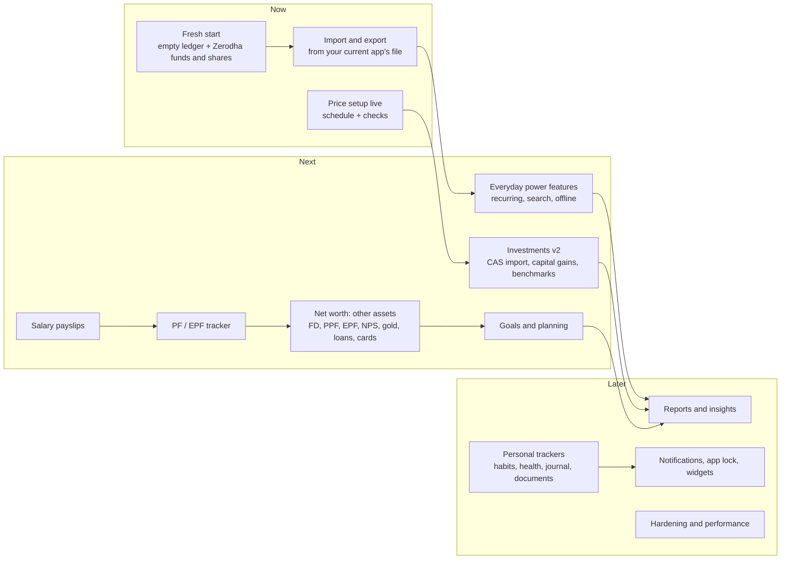

# Command Center roadmap (October 2026)

What is done, what comes next and why, and the longer plan for turning the app into Devabalan's
everyday personal command center. The architecture behind it is in
[`ARCHITECTURE.md`](ARCHITECTURE.md); decisions are in [`decisions/`](decisions/README.md). The
original audit and phase design ([`MODERNIZATION_PLAN.md`](MODERNIZATION_PLAN.md)) is historical.

## Where we are

| Area                        | Status          | Notes                                                                                                                                        |
| --------------------------- | --------------- | -------------------------------------------------------------------------------------------------------------------------------------------- |
| Expo app, design system, CI | Done            | Web on Vercel (`devabalan-command-center`); iOS/Android from the same code                                                                   |
| Sign-in and security        | Done            | Allowlisted sign-up, two-step sign-in (TOTP, aal2 in the database), sessions, idle sign-out                                                  |
| Expense manager             | Done, saved     | Transactions, calendar, stats, budgets, categories, accounts, people and splits, receipts on device                                          |
| Notes                       | Done, saved     | Text and checklists, colours, pins, labels, archive                                                                                          |
| Mutual funds                | **Done, saved** | AMFI search, purchases/SIPs/redemptions/dividends, SIP plans with due and missed instalments, FIFO cost, XIRR, allocation, growth, AMFI NAVs |
| Stocks                      | **Done, saved** | Buys, sells, dividends, bonus, splits, FIFO P&L, XIRR, sectors, day change, end-of-day prices                                                |
| Overview                    | Done            | Net worth includes funds and stocks                                                                                                          |
| Old app's data              | Retired         | Not imported (your decision); migration 0008 deletes it. The ledger starts from scratch                                                      |
| Goals, Insights, Reports    | Placeholders    | Labelled "Planned"                                                                                                                           |

> **October 2026:** the old Vite app was removed from the repository (the last commit that has it
> is `efc04a9`); its saved data is not imported and migration 0008 deletes it. Migrations 0001–0004, their rollbacks and SQL tests were removed after being applied (in
> history at `224176d`); 0005–0008 are in `supabase/migrations`.

## The plan in one picture

## Now

### Fresh start (October 2026)

You chose not to bring the old app's data over. Instead:

- **Migration 0008** permanently deletes the old app's tables (`user_workspaces`,
  `public_portfolios`) and the functions that wrote them. The planned import (a check report,
  then import) was built and then withdrawn before it was ever run
  ([ADR 0008](decisions/0008-start-from-scratch.md)).
- **Funds and shares from Zerodha**
  ([`supabase/one-time/20261010_investments_zerodha.sql`](../../supabase/one-time/20261010_investments_zerodha.sql),
  committed at your request): every SIP instalment, buy and sale from your Zerodha tradebooks,
  checked against your Kite holdings (units, invested and shares match). It replaced a first load
  from the Excel tracker, which lacked trades the tradebooks have.
- The expense manager starts empty: **Add starter categories** sets up the usual categories and a
  Cash account in one tap.

### Import and export (waiting for your export file)

You will share an export from the app you use today; the importer is built around that file:
upload, match its columns, a preview with duplicates flagged, then import. It runs on the server
and the file is not kept. Export from the Command Center comes with it, in the same shape.

### Price updates live

- Deploy `market-refresh` and add the daily schedule (steps in
  [`SUPABASE_SETUP.md`](../../SUPABASE_SETUP.md#prices-the-market-refresh-function)).
- First run from the app (**Update prices**), then check `market_refresh_runs`. If the NSE
  download is blocked from Supabase's servers, the BSE fallback or manual prices keep values
  current; a paid provider is the long-term option (decision below).

## Next

### PF / EPF tracker

Your first personal tracker (chosen October 2026), after the import; it replaces the spreadsheet's
PF sheet:

- Monthly contributions: your share, VPF, and the employer's split between EPF and the pension
  scheme (EPS), entered per month or carried over from the payslip.
- Interest is added once a year at the rate EPFO declares for that year, which you enter with the
  year it applies to (no rate built into the app). It counts only once credited, not before.
- Withdrawals and advances; employer changes under one UAN; a passbook check against the figures
  on your EPFO passbook.
- Statutory figures (contribution rates, wage ceiling) are settings with the date they apply from,
  not hidden constants. EPF counts in net worth.

### Salary payslips (after PF)

- The full payslip each month: earnings (basic, HRA, allowances, bonus), deductions (EPF, VPF,
  professional tax, TDS and others), net pay and the employer's contributions.
- Net pay records the salary income entry in one step; the EPF lines feed the PF tracker.
- Totals by financial year: gross, deductions and tax deducted so far. Payslip files wait for
  private storage.

### The rest of the Excel tracker

Fund and equity history now comes from Zerodha. PF history, salary rows and digital gold come in
with the PF tracker, the payslips and the other-assets module. Sheets with passwords or identity numbers
are never read or stored.

### Everyday power features

- Recurring entries (rent, salary, subscriptions) with "record now" reminders.
- Search across entries and notes; saved filters.
- Offline add queue on phones (entries made without a connection are sent later).

### Investments v2

- **Consolidated account statement (CAS) import** from CAMS/KFintech PDFs: every fund and
  transaction in one go. Parsed on the server; the PDF password is used once and never stored.
- **Broker tradebook import** (CSV from Zerodha, Groww, Upstox and others) for stocks.
- **Capital gains by financial year**: FIFO lots, short/long term by holding period, grandfathered
  cost for older equity; tax estimates only with rates that name their source and year.
- **Dividends and corporate actions** calendar; prompts when a held share has a bonus or split.
- **Benchmark comparison**: your XIRR against an index fund or index over the same cash flows.
- **Portfolio health**: overlap between funds, expense ratio drag (direct vs regular), category
  concentration, top holdings across funds (from AMFI/AMC portfolio disclosures).
- **SIP autopilot** (opt-in): records each instalment at the published NAV after the allotment
  date; you only confirm.
- **Live prices** behind the same tables if a provider is chosen (decision below).

### Net worth: everything you own and owe

- Fixed and recurring deposits (interest accrual and maturity), PPF, EPF, NPS (contributions plus
  statement value), gold and silver (sovereign gold bonds, physical), real estate (manual
  valuations), cash in hand.
- Loans with EMI schedules and a prepayment calculator; credit cards with statement cycles and due
  dates.
- Insurance policies: cover, premium and renewal dates.
- A daily **net worth snapshot** (server job) for a true net-worth-over-time chart.

### Goals and planning

- Goals with a target amount and date (house, car, education, emergency fund, retirement), linked
  to accounts, funds and stocks.
- Progress and the monthly SIP needed, with return assumptions **you** enter (no hard-coded
  returns), and a range from cautious to hopeful.
- Emergency fund (months of expenses covered) and retirement corpus calculators.

## Later

### Reports and insights

- Monthly review: income, spending by category, savings rate, net worth change, investment
  performance; exportable CSV and PDF.
- Rule-based insights first: unusual spending, budget pace, idle cash, SIPs missed, FD maturing,
  card due, insurance renewal.
- Optional AI summaries, **off by default**: only with explicit opt-in (`user_preferences`), only
  aggregates (never raw notes or account numbers), and never required for any feature.

### Personal trackers (beyond money)

One generic **tracker engine** instead of a new module per idea: a tracker is a definition
(name, type: number, yes/no, duration, 1–5 scale or text; unit; goal; schedule) plus dated entries.
Streaks, charts and reminders are shared. On top of it, ready-made trackers:

| Tracker              | What it covers                                                                            |
| -------------------- | ----------------------------------------------------------------------------------------- |
| Habits               | Daily or weekly habits with streaks and reminders                                         |
| Health               | Weight, sleep, workouts, steps, water (manual first; Apple Health / Health Connect later) |
| Journal and mood     | Daily note with mood and tags; optional end-to-end encryption                             |
| Documents            | Private, encrypted storage for IDs, policies and warranties, with expiry reminders        |
| Important dates      | Birthdays, anniversaries, renewals, warranties                                            |
| Vehicle              | Fuel, service log and reminders (spending links to the ledger)                            |
| Reading and learning | Books, courses, progress                                                                  |

A daily **Today** view brings them together: tasks due, habits to tick, bills and SIPs due, and a
quick add for anything.

### Platform

- **Notifications**: push (Expo) and email from an Edge Function and schedule: SIP due, bill or
  card due, budget limit, price alert, document expiry, weekly review.
- **App lock** with Face ID / fingerprint on phones; **privacy mode** that hides amounts.
- Installable web app; home-screen widgets on phones.
- **Incremental sync** (changes since a cursor) and per-area loading when data grows; offline cache.
- Backup and export (JSON and CSV), scheduled encrypted backups, account deletion.

### Hardening and performance

- Threat-model review with tests for each control; SQL tests for every migration run before it
  ships (and back in CI if the owner wants them in the repository).
- Route-level code splitting (web bundle to ≤ 350 KiB); performance budgets per screen.
- Error reporting with a scrubber that never sends amounts, notes or tokens (optional Sentry).
- Delete the old Vercel project.

## What premium apps do, and how we do it

| Feature                       | Common in                        | Here                                                                 | When         |
| ----------------------------- | -------------------------------- | -------------------------------------------------------------------- | ------------ |
| Net worth across all assets   | INDmoney, Kuvera, Monarch        | Ledger + funds + stocks today; other assets and daily snapshots next | Next         |
| Fund import from CAS          | INDmoney, Kuvera, Value Research | Server-side PDF parsing, password used once                          | Next         |
| XIRR per fund and portfolio   | Kuvera, Groww, Zerodha Console   | Done                                                                 | Done         |
| Capital gains report          | Kuvera, Zerodha Console          | FIFO lots ready; report next                                         | Next         |
| Fund overlap and expense drag | Value Research, INDmoney         | From AMFI/AMC disclosures                                            | Next         |
| Budgets and category trends   | YNAB, Money Manager              | Done                                                                 | Done         |
| Recurring and bill reminders  | Monarch, Copilot                 | Recurring entries + notifications                                    | Next / Later |
| Goals with projections        | Kuvera, Monarch                  | Your own return assumptions, ranges                                  | Next         |
| Shared expenses and settle-up | Splitwise                        | Done (people, splits, repayments)                                    | Done         |
| Habits, health, journal       | Streaks, Daylio                  | Generic tracker engine                                               | Later        |
| Document vault                | DigiLocker-style apps            | Encrypted private storage with expiry reminders                      | Later        |
| AI assistant                  | Copilot, Monarch                 | Off by default; aggregates only; rules first                         | Later        |

## Decisions needed from you

1. Share the export file from the app you use today, so the importer can be built around it.
2. Live share prices: stay end of day (free), or pick a provider (paid feed or a broker API) whose
   terms allow personal use? Its key would live only in a function secret.
3. Phone app stores, or the installable web app first?
4. After the import, PF / EPF and salary: Investments v2 or the other assets first?
5. Tax estimates: show only gains and holding periods, or estimate tax with dated, sourced rates?
6. Personal trackers: which three matter most to you (habits, health, journal, documents, dates)?

### Decided (October 2026)

- Start from scratch: the old app's data is not imported and is deleted. Funds and shares are
  loaded once from the Zerodha tradebooks, directly in the database.
- Then import and export built around the export of the app you use today; then the PF / EPF
  tracker; then salary as full payslips.
- Parents' finances stay out of the app.
- Passwords are never stored in the app (use a password manager and two-step sign-in on those
  accounts).

## Rules that hold for every phase

- No service-role or secret keys in the app; only the publishable key, protected by RLS.
- Authorization is enforced in the database (RLS, checks, RPCs); screens and route guards are only
  convenience.
- Market data and other third-party data are fetched on the server, never from the browser, and
  never hard-coded.
- No financial data or tokens in logs; no financial data sent to external AI services by default.
- No hard-coded personal balances; sample data stays clearly labelled and only in preview mode.
- We do not claim the app cannot be hacked; we reduce risk and test the controls.
